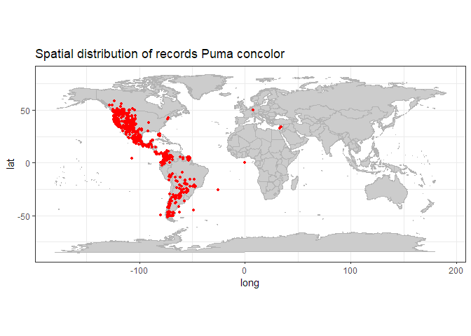
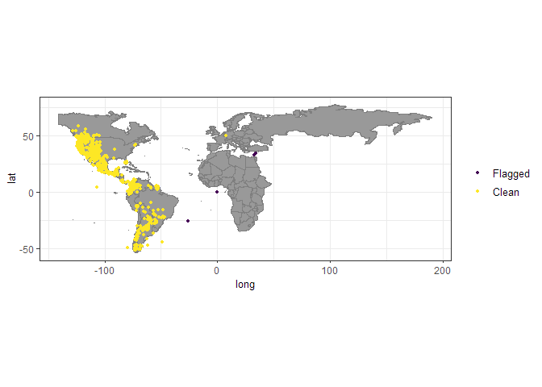
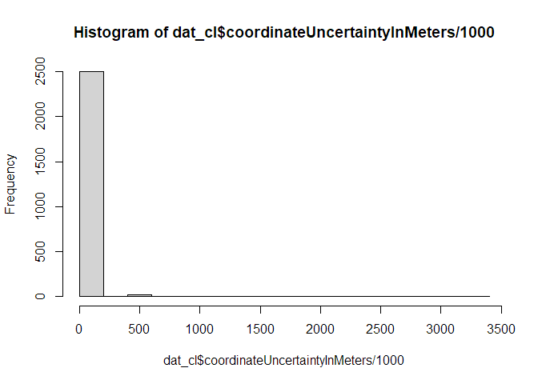
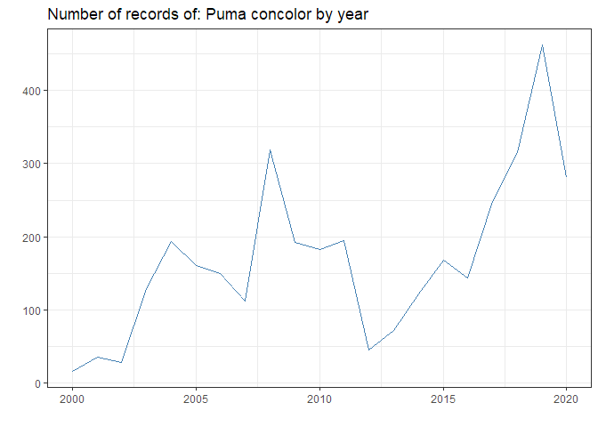
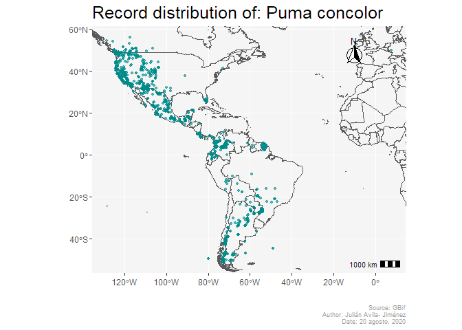

GBif data cleaning
================
Julian Avila-Jimenez
20/8/2020

  - [Get the data](#get-the-data)
  - [Record cleaning](#record-cleaning)
  - [Improving data quality using GBIF
    meta-data](#improving-data-quality-using-gbif-meta-data)
  - [Remove unsuitable data sources](#remove-unsuitable-data-sources)
  - [Check for old records](#check-for-old-records)
  - [Final publication map](#final-publication-map)
  - [Leaflet visualization](#leaflet-visualization)

Aplication exercise for search and cleaning occurrences from
[GBif](https://www.gbif.org/)

### Get the data

Search for a species of interest [*Puma
concolor*](https://es.wikipedia.org/wiki/Puma_concolor)

``` r
library(rgbif)
#obtain data from GBIF via rgbif
dat <- occ_search(scientificName = "Puma concolor", limit = 5000,
                  return = "data", hasCoordinate = T)

#names(dat$data) #a lot of columns

#select columns of interest
dat <- dat$data %>%
  dplyr::select(species, decimalLongitude, decimalLatitude, countryCode,
                individualCount,gbifID, family, taxonRank,
                coordinateUncertaintyInMeters, year,
                basisOfRecord, institutionCode, datasetName)
names(dat)
```

    ##  [1] "species"                       "decimalLongitude"             
    ##  [3] "decimalLatitude"               "countryCode"                  
    ##  [5] "individualCount"               "gbifID"                       
    ##  [7] "family"                        "taxonRank"                    
    ##  [9] "coordinateUncertaintyInMeters" "year"                         
    ## [11] "basisOfRecord"                 "institutionCode"              
    ## [13] "datasetName"

``` r
dim(dat)
```

    ## [1] 5000   13

### Record cleaning

First let’s look the data

\-remove records without coordinates

``` r
dat <- dat %>%
  filter(!is.na(decimalLongitude))%>%
  filter(!is.na(decimalLatitude))

dim(dat)
```

    ## [1] 5000   13

\-Visualize the data on a map

``` r
library(ggplot2)

#plot data to get an overview
wm <- borders("world", colour="gray70", fill="gray80")
ggplot()+ 
  coord_fixed()+ 
  wm +
  geom_point(data = dat, 
             aes(x = decimalLongitude, y = decimalLatitude),
             colour = "red", size = 0.9)+
  theme_bw()+ 
  labs(title = paste("Spatial distribution of records",dat$species))
```

<!-- -->

Then we will mark all suspicious records

``` r
#Use CoordinateCleaner to automatically flag problematic records


library(countrycode)
#convert country code from ISO2c to ISO3c
dat$countryCode <-  countrycode(dat$countryCode, 
                                origin =  'iso2c', 
                                destination = 'iso3c')


library(CoordinateCleaner)
#flag problems
dat <- data.frame(dat)
flags <- clean_coordinates(x = dat, 
                           lon = "decimalLongitude", lat = "decimalLatitude",
                           countries = "countryCode", 
                           species = "species",
                           tests = c("capitals", "centroids", "equal",
                                     "gbif", "institutions",
                                     "zeros")) # most test are on by default

summary(flags)
```

    ##     .val     .equ     .zer     .cap     .cen     .gbf    .inst .summary 
    ##        0      803      799        0      799        0        4      807

``` r
plot(flags, lon = "decimalLongitude", lat = "decimalLatitude")
```

<!-- -->

``` r
#Exclude problematic records
dat_cl <- dat[flags$.summary,]
dim(dat_cl)
```

    ## [1] 4193   13

``` r
#The flagged records
dat_fl <- dat[!flags$.summary,]
dim(dat_fl)
```

    ## [1] 807  13

### Improving data quality using GBIF meta-data

\-Remove records with low coordinate precision

``` r
hist(dat_cl$coordinateUncertaintyInMeters / 1000, breaks = 20)
```

<!-- -->

``` r
dat_cl <- dat_cl %>% 
  dplyr::filter(coordinateUncertaintyInMeters / 1000 <= 100 | is.na(coordinateUncertaintyInMeters))
```

### Remove unsuitable data sources

``` r
table(dat$basisOfRecord)
```

    ## 
    ##   HUMAN_OBSERVATION MACHINE_OBSERVATION     MATERIAL_SAMPLE  PRESERVED_SPECIMEN 
    ##                4380                 151                   1                 468

``` r
dat_cl <- filter(dat_cl, basisOfRecord == "HUMAN_OBSERVATION")

table(dat_cl$basisOfRecord)
```

    ## 
    ## HUMAN_OBSERVATION 
    ##              3566

``` r
#suspicious individual counts removal 
#Individual count
table(dat_cl$individualCount)
```

    ## 
    ##   1   2   3   4  15 
    ## 390   6   1   2   1

``` r
dat_cl <- dat_cl%>%
  filter(individualCount > 0 | is.na(individualCount))%>%
  filter(individualCount < 99 | is.na(individualCount)) # high counts are not a problem
```

### Check for old records

``` r
#remove very old records

#Age of records
table(dat_cl$year)
```

    ## 
    ## 2000 2001 2002 2003 2004 2005 2006 2007 2008 2009 2010 2011 2012 2013 2014 2015 
    ##   16   35   28  129  193  161  149  112  319  192  183  194   45   71  122  168 
    ## 2016 2017 2018 2019 2020 
    ##  143  248  315  462  281

``` r
dat_cl %>% 
  group_by(year) %>% 
  summarise(records=n()) %>% 
  ggplot(aes(year, records))+
  geom_line(color="steelblue")+
  labs(title=paste("Number of records of:",dat_cl$species, "by year"),
       y="",x="")+
  theme_bw()
```

<!-- -->

### Final publication map

``` r
library("rnaturalearth")
library(sf)
library(ggspatial)
world <- ne_countries(scale = "medium", returnclass = "sf")

coords<-dat_cl %>% 
  dplyr::select(species,decimalLongitude, decimalLatitude ) %>%
  rename(Longitude=decimalLongitude, Latitude=decimalLatitude)

coords_sf<- coords %>% 
  st_as_sf(coords=(2:3))

bbox_new <- st_bbox(coords_sf)


ggplot()+
  geom_sf(data = world, fill= NA) +
  coord_sf(xlim=c(bbox_new[1],bbox_new[3]), 
           ylim=c(bbox_new[2],bbox_new[4]))+
    geom_point(data = dat_cl, aes(x = decimalLongitude, y = decimalLatitude),
             colour = "cyan4", size = 1.2, alpha=0.6)+
  annotation_scale(location = "br", width_hint = 0.1,line_width = 0.5) +
  annotation_north_arrow(location = "tr", which_north = "true", 
                         pad_x = unit(1.5, "cm"), 
                         pad_y = unit(0.5, "cm"),
                         height = unit(1, "cm"),
                         width = unit(1, "cm"), # 0.2 # 0.3
                         style = north_arrow_fancy_orienteering)+
  labs(x = "", y = "",
       title =paste("Record distribution of:", dat_cl$species),
       caption = paste("Source: GBif\nAuthor: Julián Avila- Jiménez\nDate:",
                       format(Sys.time(), '%d %B, %Y')))+
  theme(plot.title=element_text(size=19),
        plot.caption = element_text(size = 7, color="grey60"),
        panel.background= element_rect(fill = "grey96"))
```

<!-- -->

### Leaflet visualization

``` r
library(leaflet)
leaflet (dat_cl) %>%
  addProviderTiles("Stamen.Terrain") %>% 
  addCircleMarkers(lng=~decimalLongitude, 
                   lat=~decimalLatitude,
                   fillColor = "red",
                   color = "red",
                   radius = 5,
                   opacity = 0.7,
                   weight = 1) 
```

<!--html_preserve-->

<div id="htmlwidget-6fc930071d4036bc36ee" class="leaflet html-widget" style="width:672px;height:480px;">

</div>

<script type="application/json" data-for="htmlwidget-6fc930071d4036bc36ee">{"x":{"options":{"crs":{"crsClass":"L.CRS.EPSG3857","code":null,"proj4def":null,"projectedBounds":null,"options":{}}},"calls":[{"method":"addProviderTiles","args":["Stamen.Terrain",null,null,{"errorTileUrl":"","noWrap":false,"detectRetina":false}]},{"method":"addCircleMarkers","args":[[32.703047,31.334449,37.04642,31.336033,32.702026,37.184786,43.464279,43.466725,33.698165,33.708758,33.698462,38.617282,45.906822,45.904709,33.61982,33.644812,33.687175,29.259797,38.417605,31.101939,31.101939,31.101939,31.101939,31.101939,37.063326,39.005455,36.522382,31.478403,41.22998,37.319479,37.386896,39.534345,34.317353,33.030671,37.163558,33.021109,33.021045,41.632564,32.209117,8.620622,31.333526,40.362078,37.063645,31.427963,31.101908,37.124029,-0.182022,42.27748,26.31827,26.31792,26.316426,39.491166,9.52825,38.350517,38.350658,38.35048,38.352198,38.352198,38.352198,38.352198,35.155785,32.883324,-51.065364,49.782371,-0.291275,34.356074,34.355763,40.642951,41.135601,33.163692,25.975515,34.324075,34.340627,47.86552,33.021185,41.712933,41.630618,32.754845,41.319815,23.637525,41.782769,33.15845,34.13515,37.290698,31.488593,23.628813,37.290736,34.13515,37.571678,34.319138,38.539541,37.111128,38.453099,38.478239,38.225103,24.486075,34.222895,23.536451,37.111123,38.469883,32.703847,38.482737,26.034472,38.411935,41.691086,37.13208,29.153945,29.154179,8.659607,31.333739,-32.755877,38.350517,38.35048,-47.777364,-1.404419,38.259262,38.45749,45.267153,38.352198,38.352198,38.352198,38.352198,45.346519,-1.406433,37.407119,37.20815,38.510231,0.948257,38.534043,38.402319,38.556908,17.281578,44.548533,26.281472,31.774855,40.733312,32.535193,40.02724,11.010152,10.355167,36.45765,-47.026975,25.383907,47.913469,36.46325,41.747408,37.085466,36.45585,38.632807,38.431139,33.092902,38.540762,31.101979,33.006535,38.494026,37.464747,37.1295,48.34028,38.350434,32.410482,38.351526,38.350434,-1.406433,-50.98,32.834941,47.944932,33.745834,36.396261,32.932812,38.525728,33.015171,38.487874,41.662669,35.071828,34.56473,40.294012,43.890085,34.085763,26.492885,32.826221,41.633524,33.058957,33.124139,31.101946,32.355046,31.101958,31.101958,0.349977,37.068366,38.407227,24.334784,37.172175,37.129478,37.12945,37.141045,38.578483,34.250664,34.604929,38.350517,38.350434,38.350434,47.258251,34.54601,32.829368,34.487111,41.739791,38.677198,31.138056,36.516997,41.775426,37.611233,41.778571,39.586784,31.138056,31.138056,31.138056,33.126504,41.708053,34.418527,46.977703,31.083154,31.101944,31.101944,31.138773,37.141026,37.152852,33.066242,37.129494,-31.395894,34.286528,34.224935,41.756408,41.713971,37.009079,38.898778,33.02118,-31.330666,41.627428,39.262553,32.835602,48.464539,48.381358,-31.768143,41.631042,37.757994,31.138773,31.138773,41.335958,42.663527,41.967645,37.129482,37.129506,37.129478,-31.222664,39.197192,-31.745599,32.707347,26.33843,41.707264,31.138773,31.604831,48.023646,31.693596,31.604834,32.704497,48.084903,48.370175,34.418997,32.852713,37.105543,48.126426,35.791187,48.281059,37.119725,47.906057,37.619566,41.640351,36.645345,37.145217,31.377879,34.446555,25.576582,32.745623,38.481486,31.334842,32.648646,32.649972,37.050542,37.050632,33.068336,32.909436,41.695009,40.363404,38.540315,37.04786,31.913204,47.575423,47.582052,38.539705,37.111321,49.605445,21.263193,37.379683,37.159819,6.38751,30.523042,-26.645508,-51.182194,-51.071667,-0.51008,-30.070705,35.240762,33.51372,-21.07332,-21.072947,49.293319,16.883787,40.264638,34.284573,40.779724,40.800745,32.683195,50.57401,32.683195,38.592427,39.6533,34.284821,31.538127,47.083345,41.317191,31.102148,31.102149,31.102147,38.59145,38.580518,6.246027,37.446608,37.577452,49.201079,31.465904,32.702703,0.349977,-0.333298,25.543933,-22.324158,31.312488,31.323951,31.604445,33.122844,34.465162,34.282333,33.502636,34.284328,48.536043,50.800116,31.102147,31.102147,31.102149,31.102149,38.537887,38.582096,38.306978,37.203647,31.796683,32.708378,9.359961,31.538002,35.343563,38.617387,38.578055,18.049848,32.796182,37.162576,25.503471,25.583624,25.434655,38.723133,33.077754,39.864209,31.315244,31.313542,34.32209,-1.404179,8.411309,49.581676,39.319125,38.411166,34.41907,38.428032,40.657139,37.58164,14.524513,38.585791,22.141362,40.336113,19.189571,28.963259,37.07214,37.061869,37.061833,37.047797,38.420212,9.266809,37.199886,35.134568,39.864209,39.852459,39.8472,33.102483,15.654227,40.789379,17.517307,32.252848,0.349977,47.880164,38.591409,32.933824,38.702449,46.945588,-34.210569,21.738143,37.40727,23.266337,35.23687,42.343529,37.047574,38.448026,38.51671,33.154898,38.430371,39.852459,39.84712,37.06848,47.882084,31.903515,45.456576,41.71747,33.135238,33.691425,33.640485,33.716786,17.6483,17.52901,17.631498,-1.404176,16.767653,33.147417,37.166272,32.835225,40.833282,37.047565,10.35192,44.630588,38.129187,38.27605,37.041748,38.862833,32.8397,33.933081,34.362172,39.84731,16.789089,50.840793,38.178165,25.25024,48.240818,-16.443591,33.16467,27.898673,-50.840478,-32.902842,0.349977,49.327784,42.492423,42.492423,23.653861,41.829904,45.649975,38.344337,43.671395,34.41908,38.507611,33.152608,33.270427,37.195911,37.177691,39.84737,39.846244,37.048113,37.048013,49.340172,39.640484,21.453753,49.415766,37.135255,18.222869,35.136292,40.588915,51.492834,37.04675,49.256796,37.165885,37.04748,37.047611,37.120773,38.741792,49.579172,41.613614,34.419034,34.419111,38.352198,37.408399,42.492782,23.652607,23.652607,23.653861,33.04116,33.044716,26.197022,37.068436,38.765624,31.666832,33.292858,33.39089,37.178262,32.716999,35.540332,33.290168,32.699297,35.598261,37.047537,37.129508,37.135067,17.58,-1.020963,49.587352,48.968748,31.701267,38.352198,38.352198,38.350848,38.352198,38.350848,38.352198,38.352198,38.351514,38.35171,38.35171,38.352198,33.632505,33.751853,33.774733,38.35048,38.35048,42.49131,42.492782,17.652206,23.652607,37.118691,37.047415,37.04732,37.047044,38.991327,37.620663,5.231844,38.46691,38.513028,33.294212,25.60431,37.047803,47.572593,33.101056,37.26691,37.266055,40.361957,-30.554103,32.716769,36.539932,37.187639,34.13515,34.13515,37.12958,35.557488,51.49391,33.337616,51.106713,37.118621,37.118618,49.579172,17.278244,41.686871,48.79779,38.35171,38.352198,38.350517,38.35048,17.519199,23.653861,-51.036731,27.330431,46.24543,37.118697,32.854765,32.69813,-9.175692,32.699024,32.841214,37.40708,41.215606,37.950124,33.218905,37.433831,32.8328,32.8325,38.562078,37.174894,37.156911,37.132038,37.132064,33.507171,37.132049,37.342332,37.186904,46.205668,33.077825,21.526108,34.13515,34.13515,34.13515,34.13515,34.13515,40.477159,-47.048299,-47.327632,34.33319,-46.203834,-46.253771,-28.783461,37.350057,38.350658,56.05458,38.351526,38.35171,38.351037,36.201524,-33.654623,33.16494,33.153343,33.077974,31.385968,31.333179,33.740991,33.740851,33.74235,33.077995,34.439392,33.058023,33.742937,33.05268,37.18531,34.45826,33.013069,34.543711,41.650177,25.907162,36.134822,36.116979,39.152821,37.479183,34.13515,40.645135,37.129514,37.129517,-10.127107,-46.22117,37.129498,37.128352,37.047927,37.129507,37.134414,36.493712,33.065868,37.068439,47.602162,37.048032,17.252376,0.393586,37.128452,48.435145,38.350517,38.533407,49.27777,24.951537,-1.404066,35.18893,-30.064723,34.13515,37.297417,40.647503,48.034638,34.195573,37.35184,41.631633,37.206518,37.04676,37.068386,33.48483,41.620068,32.428239,-46.306236,40.720309,34.538692,41.691666,25.692488,25.342533,38.492869,38.432249,38.401733,38.577401,37.186377,37.048078,37.047939,37.071164,37.186361,29.379058,29.377001,29.283816,37.140359,37.046331,33.123225,32.836705,37.132102,38.441574,26.320265,26.318557,26.315539,38.35048,28.300797,0.145046,-1.406433,-1.406433,-1.404419,-33.75181,38.418883,33.638442,37.175693,37.047749,37.047627,37.047464,36.507232,34.839806,40.782501,39.437227,37.047321,16.056195,35.323801,39.992277,37.047495,37.179609,16.145796,32.653511,32.653477,8.640454,6.981877,6.871933,6.848432,50.28031,36.504106,47.768428,-46.72476,4.644243,0.349977,20.331411,33.393823,37.173859,39.690372,48.033963,37.12916,38.480671,38.467619,38.54498,38.449699,38.457078,38.543816,16.06705,38.423689,38.484477,36.479504,33.155196,0.022056,50.279832,9.868272,20.07827,17.65678,31.328795,31.332503,37.0477,43.501313,39.675272,37.0758,38.488963,38.408233,38.543715,48.039172,31.070805,38.402133,38.494989,-49.907241,48.051558,33.139653,-49.969619,39.415775,35.22668,33.045365,26.145726,31.316688,-51.049736,38.491368,-1.428952,37.120401,38.458848,37.148376,38.585179,38.539479,38.591815,38.589919,37.04642,34.110992,39.977214,37.168245,37.171091,38.504604,38.48214,38.505626,0.816199,39.043186,47.295303,32.014316,32.014168,32.014236,32.013054,32.012146,29.51824,37.029743,37.556346,-50.942701,37.53563,-36.503967,-38.696288,34.081051,38.425588,38.576718,37.321409,31.070845,36.500199,38.554583,37.086301,38.248657,38.238964,37.573055,31.400103,16.043454,37.169778,38.513237,39.085903,36.98582,38.541259,37.467229,32.97806,37.12046,32.263627,38.208312,39.261485,28.857599,53.310097,20.396071,23.701975,31.527121,48.051808,-22.287235,34.4002,34.399975,34.399933,38.533646,37.577665,44.009308,-16.237834,38.471464,38.518087,38.437711,-0.547531,37.10791,49.58321,50.19877,-28.642138,-32.645116,38.417697,34.349518,39.974679,42.013588,34.579942,21.212432,31.312614,32.708764,29.178255,4.09019,39.606539,33.344207,31.322035,-33.545306,38.573327,39.315872,31.725088,40.924775,39.98269,40.898392,32.703375,38.499535,32.940092,32.940101,32.940075,38.490697,38.462918,36.683756,39.980858,-33.575863,41.206283,37.32077,37.32041,48.673714,21.263816,33.046682,17.319256,37.35926,32.69673,38.419346,38.432868,38.420125,37.911871,33.109839,37.059533,34.455203,33.096519,37.951462,34.559,38.500781,37.934869,37.102587,21.38065,23.382952,37.514153,40.687301,-51.042172,39.433412,21.382993,39.421524,25.693705,40.574292,32.815286,33.139342,33.139283,33.139138,33.139073,36.493825,36.494488,26.358258,31.991971,32.69352,32.69352,47.694019,37.10964,31.985719,37.102617,39.458258,40.872616,37.578641,23.37546,40.321408,37.386212,32.754176,32.754084,37.130392,37.179919,35.482472,34.31095,34.053165,47.125401,36.492333,37.102853,37.102898,32.655699,37.064444,32.689445,31.132078,34.538795,34.631098,38.42625,38.548444,37.921656,36.990772,32.701958,33.239722,38.464806,34.94767,39.086283,33.046736,32.879061,29.336216,40.657116,29.057403,29.058003,39.463914,4.09019,37.464253,47.162264,33.152238,-30.361221,38.352198,38.352198,38.352198,38.352198,38.352198,38.351514,-51.03,-16.747007,-51.03,-51.03,30.568107,41.505025,37.559587,34.587158,40.816387,32.389169,32.856796,34.587712,-50.958501,32.955793,32.855495,34.260362,39.13365,31.132089,31.132091,31.101915,38.337719,37.047697,37.047448,37.050667,37.050667,37.050667,41.734459,34.33319,-33.628762,37.35363,37.119959,23.301527,33.117808,22.940556,18.361075,23.6819,26.203164,37.363797,34.341324,37.188943,-40.00165,31.917645,31.917688,34.809536,8.454176,33.165131,23.682145,42.925556,15.771558,31.689197,9.31208,9.31208,30.208694,38.407448,34.306004,37.112293,33.13675,-50.809994,34.305972,6.7121,-50.84827,-51.140878,25.347047,8.391172,38.888692,8.449956,0.398042,38.370172,38.368987,36.135065,34.01254,34.276965,31.32229,33.194679,48.08262,49.043729,34.32124,34.32229,38.983828,33.554393,5.575225,37.356619,8.508101,36.963689,29.250976,39.163681,0.398042,18.341358,18.341575,37.047904,37.068646,34.3695,33.66825,37.112635,20.550509,20.581367,37.112425,4.090194,31.970699,32.653001,14.945243,44.630589,32.332541,18.268704,49.305032,39.085439,37.066513,37.04767,32.90768,32.90768,32.90768,21.869146,34.39793,40.215546,44.51497,32.222367,21.398303,34.172383,49.651952,21.314583,49.658532,44.705454,31.276725,31.332646,31.274278,31.366722,31.362525,31.312972,31.359278,31.308611,31.367056,34.409212,34.40197,23.683487,37.068629,32.905708,41.195503,37.068838,44.412202,31.078289,37.172628,25.799104,31.273407,9.582887,20.301616,20.3226,31.293556,31.208639,37.068595,32.85337,1.711658,1.797922,37.181271,37.181895,-12.816152,32.18368,20.263185,20.348352,20.385701,37.362036,32.85615,37.184103,37.184069,32.847333,32.85621,37.047554,38.566189,38.482594,40.484025,35.537158,38.052297,-30.98556,40.499375,50.944726,32.70269,32.70146,32.385863,33.09777,33.09777,33.09662,33.09662,16.174699,16.999994,37.04786,5.733049,37.165731,38.54545,37.165201,37.047098,32.909,33.664597,33.611014,33.719605,33.611014,33.611023,33.09662,16.999429,38.575621,38.569611,37.408875,32.46022,17,31.284791,8.485101,17.642262,17.642262,31.348472,22.2275,22.162222,22.162222,22.200556,22.271111,22.162222,22.250833,22.162222,22.227778,5.607913,31.365981,37.053211,31.845067,31.845211,31.845081,31.845325,37.045523,37.045523,15.877511,31.101911,31.132112,31.846006,34.111893,0.117589,6.814001,4.090194,32.847503,33.371525,33.098397,31.365971,31.365994,33.792713,20.336586,-2.173733,22.301111,22.162222,22.200556,22.234167,22.301111,22.162222,22.234167,22.301111,22.301111,22.301111,22.250833,22.200556,33.154915,33.154476,32.456605,37.185054,37.047493,37.191804,37.047933,37.572639,37.185077,39.418945,33.367222,33.367222,38.473871,38.406178,8.546267,39.594577,39.273172,6.733862,6.960559,6.96043,31.901583,31.908283,6.684012,6.76099,33.990892,37.180558,44.956025,-47.181397,19.583245,39.437239,32.652819,31.526111,31.84673,18.282007,37.403615,37.123404,23.291377,33.13669,32.649582,-17.581194,-17.619155,-50.088658,17.25385,16.91013,17.20571,37.300017,31.231366,24.608208,37.037037,21.063259,38.030757,5.571811,17.28263,17.28596,25.54286,37.447416,34.425606,37.172782,26.076829,38.378003,38.378003,20.424881,32.643663,32.644586,38.015161,50.324176,15.695103,17.25385,17.2397,10.423268,40.035733,34.139882,34.08269,34.011431,40.375488,34.153118,34.165245,-13.806409,23.697443,-16.969215,-25.850449,32.300745,21.060241,34.074323,48.643481,25.277414,32.938337,48.636409,-29.864772,39.409612,17.180204,50.788453,48.579443,17.26353,31.796557,37.313942,37.581595,48.714581,23.686995,23.700454,39.129939,37.581693,32.574013,23.663393,37.19693,31.87907,7.412861,33.096168,-19.410629,36.202356,38.559121,39.151605,31.996131,32.907168,23.622134,49.606674,43.702975,48.833125,18.362631,22.084303,34.32,34.32,23.155069,23.356381,23.355692,23.355593,37.195029,-15.90527,-26.669491,38.548317,23.67304,-19.588499,33.102389,44.564969,39.953335,32.654413,44.060453,34.32,31.917252,23.635954,23.667481,23.658043,23.658043,23.667569,37.145184,32.910181,32.90937,2.261,37.042049,17.153498,32.898525,44.054994,17.881913,38.559832,36.519534,39.437572,36.525475,31.81431,31.81558,34.792755,41.269403,32.896401,37.10976,37.10832,21.314583,40.109066,49.234313,33.080775,34.213786,34.213825,22.343989,21.506178,39.235029,37.050266,37.050199,44.861512,-15.881654,34.364283,-51.158701,39.643269,37.197841,17.27929,17.27451,17.27451,17.27451,17.25385,32.05238,6.007717,6.007717,5.988517,5.934317,5.92835,5.924767,49.60091,9.386367,17.498947,36.434322,17.24506,17.26353,17.28596,17.28596,37.085386,32.648764,33.933178,46.021224,37.578378,16.91608,10.430623,29.798547,17.101848,6.431722,17.28263,31.915307,31.985748,23.353544,23.353525,23.353505,23.332799,23.311873,23.30334,23.290313,22.677065,22.591428,22.59119,23.36952,39.40933,35.272128,38.236301,17.12954,17.12144,17.12144,17.25385,17.12954,17.12954,17.26353,33.059685,37.373603,29.346289,23.353564,23.359001,23.35904,23.359119,23.358646,23.358922,23.353603,23.31938,23.256901,23.290313,23.290391,22.669739,23.410012,-32.352541,46.956659,17.27451,23.359119,23.358843,23.358646,23.353623,23.319361,23.290549,23.411272,16.91792,17.25385,17.2782,17.497854,38.459475,23.358765,23.353662,23.353722,23.31207,23.303438,23.290549,23.381495,23.382283,23.409381,33.185573,16.175049,10.123056,32.726734,-19.493931,-2.033095,17.26353,31.917933,31.869523,40.267954,6.441948,23.346393,23.31207,23.369362,16.175688,35.672372,16.175949,38.405708,34.864498,32.64867,32.648652,32.696912,17.21155,17.21155,17.494425,31.691705,23.291594,23.291732,22.56797,-51.18339,32.656096,-20.109132,36.17443,9.363421,17.252876,23.291574,23.291574,17.011977,41.244876,30.789463,33.42066,0.35002,-16.678189,32.65093,32.003564,44.854771,35.254246,32.008804,23.291436,34.446556,21.535962,34.000498,34.152096,27.004201,17.041358,32.352515,27.01509,32.008804,32.038604,23.328858,43.83748,17.21155,17.21155,17.25385,17.20571,-51.152718,37.721349,16.976893,-39.585951,16.75078,31.839211,31.783373,29.211183,21.903234,50.929728,14.870275,29.20924,29.211368,31.706837,31.845971,34.708222,49.587768,37.526584,37.445732,37.526609,37.552131,17.101607,-24.030416,17.27929,-34.992023,29.327339,29.213545,44.45731,17.485076,31.771416,31.853268,32.245968,23.681841,35.789078,40.146653,17.27929,-34.756025,-34.631599,-34.795755,33.424765,23.678675,23.682325,36.86515,36.864372,36.861857,36.863777,34.472635,30.398983,17.24506,17.478316,-34.667095,-34.755608,-34.611699,-34.654069,-34.741356,-34.646015,49.601891,23.388113,29.255958,-22.530035,17.27929,17.2397,16.91608,17.27929,17.27929,16.91608,41.448259,16.122067,23.406388,23.406428,23.388113,23.358883,3.869506,3.240692,17.499545,-20.493321,17.28596,17.2397,23.68213,16.122067,49.601819,49.595491,23.35904,37.222564,4.845017,35.089996,17.182072,39.085934,32.025336,29.205715,17.27929,17.24506,34.425273,37.570161,31.843039,31.366529,3.58455,3.546531,43.217212,17.182041,17.24506,17.24506,17.20518,17.24506,17.24506,17.24506,54.413404,31.470755,31.683268,31.694738,31.686575,32.129757,32.129663,31.997376,16.146339,32.129757,31.691343,32.129757,6.262611,17.27929,17.21155,16.91267,17.25385,-1.146726,-39.437702,37.37961,6.252222,-36.825829,38.015161,17.26163,17.26163,17.26163,17.26163,17.26163,17.26163,17.26163,31.985254,29.182901,6.812667,44.847922,10.431345,20.312433,19.472816,34.103151,29.963265,32.283048,17.2584,34.076462,2.770167,17.2584,17.2584,17.2584,34.539435,5.6805,17.2584,17.2584,38.449698,17.2584,41.907334,33.536167,38.527882,29.647019,42.246833,34.261082,20.902295,39.51852,37.148966,17.2584,43.711333,32.850683,3.725361,17.2584,43.685592,31.453231,33.112333,33.202556,-1.146726,21.296227,4.606061,31.74575,31.705967,31.690036,31.690085,33.202183,47.74324,27.04814,29.244782,17.449428,17.424283,17.495649,32.043949,37.402709,19.475324,37.410937,49.608253,2.41027,-42.72469,-50.53874,-49.6673,-49.66835,9.301381,16.212514,-50.55735,-50.53166,-38.9934,-38.9934,35.128297,17.651059,-50.52547,-50.5225,-50.49554,32.754741,37.301799,-39.01666,-22.520033,-25.67323,5.566462,5.1104,5.104908,-50.34027,39.262811,17.6528,8.480352,37.497626,25.487711,16.845954,3.659,17.246262,38.7657,38.369471,18.087141,21.202746,36.184483,31.694905,5.133361,47.256631,34.333411,29.133628,26.073389,37.40354,34.369954,5.12955,5.5053,4.59457,36.192677,-50.51241,-50.52249,37.553015,46.192293,-41.34947,6.092778,20.878119,-19.496551,25.323265,3.74903,-50.5225,-50.54333,2.8679,-50.48527,-41.20491,33.587348,41.309288,-50.46318,-50.46512,-19.593246,39.207579,41.270184,-50.48436,-39.37027,-39.40527,-38.99569,-12.419917,-50.50682,-40.49922,35.384506,3.595526,3.485469,3.546199,3.485469,3.756763,3.554069,3.623849,3.563484,3.621519,3.621519,4.610093,3.485469,4.731276,4.369577,3.621519,3.645929,4.373403,4.119642,3.772599,3.560771,3.895549,3.76627,4.208177,3.736891,4.19061,4.135297,4.009246,3.634763,4.610093,3.619492,3.607218,3.634763,3.563484,3.628979,3.608438,4.578634,4.535381,4.517226,4.610093,3.606216,3.563484,4.610093,4.592994,3.828699,3.802852,3.776775,4.055913,3.824689,3.753872,4.025083,3.770982,3.86043,3.901279,3.753132,4.141169,4.135643,4.002314,4.119344,4.119642,4.006405,4.119642,3.824689,3.770915,4.111591,4.010608,3.69696,3.739762,3.531515,3.369002,3.679461,4.111591,3.512539,4.171104,3.50019,4.09235,3.570986,4.476988,4.543956,3.615064,4.369577,4.633628,4.17334,4.606237,4.606237,4.563219,3.621519,4.633628,4.114151,4.025083,4.032437,3.714567,4.164615,3.858002,4.007995,4.135297,3.824689,4.027546,4.017353,3.820359,4.044013,3.705405,4.0204,3.824689,3.755974,4.167054,3.745701,3.824689,4.167054,3.994097,4.15745,3.452407,3.531515,3.531515,4.096175,3.924213,3.507912,3.503398,3.470651,3.585992,4.119642,4.020962,4.05139,4.190973,3.80518,3.857307,4.066542,4.03722,4.055088,3.537326,3.27006,3.91304,3.536348,3.561544,3.977191,4.167199,4.163745,3.810341,3.934555,3.624423,4.076992,3.531515,3.537326,3.537326,37.010672,6.699083,-50.56377,-50.52454,6.701038,-36.383807,3.05603,47.597337,-50.49557,29.167194,-51.079981,-51.088154,-51.008828,-49.67833,33.285575,40.888133,38.772039,26.108259,26.065235,29.03778,3.5355,3.73168,4.56617,4.97191,5.60934,4.0561,4.0705,5.22825,5.49016,4.58023,4.58023,4.58023,4.58023,4.58023,4.58023,4.58023,3.69234,3.69234,3.69234,3.69234,3.69234,3.69234,3.69234,3.69234,3.69234,4.58023,4.58023,4.58023,4.58023,4.58023,4.58023,4.58023,4.58764,-39.34839,-47.57804,-49.32766,-49.33138,-49.33306,-49.3326,-49.33223,-49.33366,-49.33251,-49.30318,-49.30355,-49.29655,-50.55424,-25.66136,-25.6791,-39.34839,-50.38611,-50.35305,-50.34777,31.883602,-39.36238,-47.66686,-47.63738,-49.36272,-49.33334,-49.33354,-49.33328,-49.32977,-49.3334,-49.30299,-39.36238,-50.35959,-50.34888,-50.34777,-50.34777,-50.33055,-50.33055,-50.33722,-50.33722,31.457699,8.48,-47.58172,-49.33305,-49.33347,-49.33305,-50.34805,-40.61922,-47.83232,-47.82081,-50.52249,-27.98506,-50.35361,-50.34944,-40.57317,-40.56495,29.273045,29.310011,37.494899,-49.25208,-50.55424,-25.67622,-50.34881,-41.34838,9.301254,29.277383,0.431418,-49.28451,-25.67778,-25.67465,-25.6777,-25.68866,-25.68929,-39.05096,-50.29888,-50.35388,-50.34638,-47.75275,-13.753475,-47,-50.55574,-50.524,-50.35138,-50.3575,-50.2475,-50.34888,-50.34833,-50.34916,-50.34944,-50.34972,-47.75351,31.489052,17.422028,-25.69495,-50.31722,-50.34944,-50.35361,-50.35333,-50.36111,-50.34722,-50.36083,-50.28027,-50.35,-47.7545,-47.75305,39.503493,8.171667,10.428271,2.8679,-33.620586,-47.64991,-50.40777,-50.34871,-50.34265,-50.3681,-50.34344,-50.3681,-50.3664,-50.3607,-50.34551,-50.35944,4.073611,-24.3064,-50.32305,-50.25889,-50.34886,-47.55345,-49.91666,-37.99884,-38.00455,-28.03938,-50.3225,-50.34419,-50.34611,-50.34194,-42.10568,29.336,23.778222,22.6303687611839,40.834576,-50.50778,-39.38,-50.34849,-50.34784,-50.25916,29.289269,19.588601,33.629396,-49.30286,-49.3026,-49.30551,-49.33401,-49.40097,-49.33336,-49.29438,-40.10851,-40.14859,-41.18925,-42.09499,8.545378,-40.10851,-40.14859,-41.18925,-42.09499,-50.69159,-50.35617,4.895933,19.585389,19.608327,19.588601,19.588601,19.588601,19.582471,19.582471,19.620614,-49.3003,-49.3322,-49.33321,-49.30268,-25.70652,-47.02002,-25.70652,-40.01864,-41.01889,-40.01864,-37.90693,-50.34801,-41.01889,19.588601,45.928294,-47.57811,-49.3026,-49.36233,-49.32766,-40.96883,19.453235,-40.96883,-38.00262,-50.34781,18.400414,18.400414,18.341872,18.369278,33.098064,19.620857,18.369278,18.400414,18.400414,18.341872,40.427377,-47.65954,-47.64438,-47.70375,-49.29979,-25.6903,-25.6903,-38.00544,-38.02996,35.125939,21.443889,21.443889,18.418023,18.418023,-49.30056,-25.69058,-30.006912,19.504459,8.560631,-25.69058,-42.90061,-42.90061,-50.3258,-50.20691,-50.34825,4.895933,20.421227,-49.7842,-47.79156,-47.79269,-39.23015,-39.82488,-39.82528,-25.68843,-39.23015,-39.82488,-39.82528,-25.11595,6.19325,21.49083,50.005531,-47.57968,-49.32227,-49.32264,-49.32281,-47.95097,-47.94905,-42.02627,-25.72965,-25.72823,-25.72278,-25.72038,-25.07097,-25.11776,-25.17411,-25.72965,-25.72823,-25.72278,-25.72038,-39.82396,-42.02627,-49.32836,-49.3726,-49.32264,-49.32204,-39.82396,-50.20696,-25.07097,-25.11776,-25.17411,-39.38944,-39.3718,-39.38944,-39.3718,-49.32318,-49.32327,-49.33369,-49.32327,-49.32264,-38.00395,-50.33628,-50.32659,-50.30681,-47.68323,-49.32438,-49.32953,1.079568,-49.32363,-49.32363,-38.00151,-50.31492,-50.37533,32.007702,-49.38088,-49.32609,-49.30586,-49.30713,-49.30392,-49.29946,-50.32373,-50.32389,-50.3853,37.510134,0.999256,-49.25062,-49.31549,-38.00524,-37.99573,-50.35653,-50.30371,-50.30545,-40.69146,-47.8324,4.073333,6.763332,-39.20933,-49.33444,-49.29361,-49.29939,-49.29629,-49.33222,-39.20933,-50.3357,-50.33077,-50.3689,-50.33992,-50.30681,-47.8158,6.224778,21.49083,17.55897,39.746452,-47.60539,-47.60227,-47.58461,-42.30586,-49.03266,-25.5891,-25.79154,-25.75656,-25.60003,-25.56757,-25.68708,-25.68664,-25.80901,-25.78971,-25.77056,-25.66539,-25.65066,-25.74765,-25.62419,-25.71992,-25.61222,-25.78392,-25.72491,-25.70526,-25.8229,-25.81084,-25.80421,-27.9989,-25.70216,-25.72499,-25.96691,-25.96291,-25.89446,-25.87865,-26.01092,-25.98569,19.588232,-25.5891,-25.79154,-25.75656,-25.60003,-25.56757,-25.68708,-25.68664,-25.80901,-25.78971,-25.77056,-25.66539,-25.65066,-25.74765,-25.62419,-25.71992,-25.61222,-25.78392,-25.72491,-25.70526,-25.8229,-25.81084,-25.80421,-27.9989,-25.70216,-25.72499,-25.96691,-25.96291,-25.89446,-25.87865,-26.01092,-25.98569,17.59641,19.585443,17.59256,32.943651,-47.74994,-47.58229,-47.58182,-47.67114,-49.33715,-49.3041,-49,-39.53382,-50.34436,-47.75806,-39.53382,19.583016,19.605126,19.522315,19.522315,19.522315,19.522315,21.43246,19.585443,19.614219,19.614276,30.534722,30.551667,30.553056,8.327607,-49.30708,-49.29555,24.417388,24.496051,24.365354,19.591282,19.591282,19.591282,21.43246,-39.16319,-40.6,-46.97274,19.585583,-39.16319,-40.6,23.924131,21.44367,21.44367,21.44367,21.44367,-49.33191,19.585583,-24.97052,-25.1219,-24.97052,-25.1219,19.3517,19.3517,19.3517,19.3517,19.3517,19.3517,19.3517,19.3517,19.3517,19.3517,19.3517,19.3517,19.3517,21.43246,21.34861,21.33084,21.35892,21.35892,21.34237,21.3783,21.3783,21.3783,21.34237,21.3783,21.35892,21.34861,21.33084,21.35892,19.588232,19.588232,-25.64266,19.588601,21.3593,21.3593,21.3593,21.35151,21.35151,21.266667,21.34573,21.34573,21.35738,21.34861,21.34861,21.36778,21.36778,21.33564,21.36778,21.35892,21.35892,21.22956,21.35892,21.35892,21.37778,21.35892,21.36951,21.36951,21.3783,21.35728,21.35728,21.35728,21.35728,21.35728,21.35728,21.3593,21.34861,21.35892,21.34573,21.37778,21.35728,21.35151,21.35892,21.3593,21.35892,21.3593,21.33564,21.34861,21.3783,21.35728,21.35738,21.35728,21.36778,21.36778,21.36778,21.34573,21.35728,21.36951,21.35151,21.36951,21.35728,21.35728,21.35892,21.35892,21.266667,21.22956,-25.65555,-25.65351,-25.64799,-25.64521,-25.64418,-25.64332,-25.64318,-25.64266,-25.63617,-25.65555,-25.65351,-25.64799,-25.64521,-25.64418,-25.64332,-25.64318,-25.64266,-25.63617,-25.70074,-25.68065,-49.32264,-25.69949,19.588601,21.35151,21.35151,21.34573,21.34573,21.35738,21.36778,21.35892,21.35892,21.34237,21.3327,21.34573,21.35738,21.35892,21.3327,21.35151,21.34573,21.35151,21.34237,21.36778,21.35892,22.061416,31.673527,-40.92095,31.144722,-49.3259,-49.33758,19.585583,-25.69013,-25.66867,33.804755,33.534849,19.587947,19.608327,19.588601,-49.32758,-49.2998,-49.31513,-49.33342,-40.01386,-50.34825,-40.01386,-36.379705,21.43246,19.595698,-47.68548,-49.29948,-49.32776,-49.32437,-37.99034,-50.34825,-50.46774,-50.34825,-47.00568,33.632326,19.60209,21.45447,19.595698,19.605099,19.597707,19.588601,19.588601,19.588601,19.588601,19.588601,19.588601,6.016472,-49.31555,-49.33324,-25.66144,-40.00081,-37.99739,-50.34723,19.588232,39.83111,-25.66144,-40.00081,39.977665,-47.65439,-42.14844,-25.85779,-25.85779,-42.14844,19.560503,-47.68,-50.30732,-50.26564,-25.89183,-25.89183,-26.86417,19.64863,17.59641,-49.26031,-40.53996,-40.53996,19.627395,-50.2667,-50.20866,-50.32666,-40.5484,-40.5484,17.59641,17.59641,17.59641,17.59641,19.642197,-44.57225,-44.57225,-49.30764,-28.01482,-26.024,32.899318,-26.024,-28.02876,-28.01418,17.55897,-39.15011,-28.01523,-41.43622,-25.79326,-25.85026,-26.42975,-25.75087,-27.79565,-28.01523,-25.79326,-25.85026,-26.42975,-25.75087,-27.79565,-39.15011,-41.43622,-28.01567,-28.00524,17.56375,19.564147,19.564147,-28.03421,-50.34347,-50.34347,-42.2277,54.367838,-28.03421,-42.2277,-28.00524,17.5645,19.618614,-49.93366,-47.76423,-26.00074,-25.68219,-26.00074,17.56375,17.59641,48.785163,-40.15919,-40.54573,-25.11613,-40.15919,-40.54573,-25.11613,17.59641,-47.68046,-47.65867,-26.56535,-25.83659,-25.68972,-26.56535,-25.83659,15.723468,17.58373,17.56686,-47.63672,-49.33046,-49.30586,-25.81432,-25.67936,-25.684,-25.81432,6.193139,49.013221,49.019343,49.019637,17.59256,-25.71443,-50.24644,-50.32666,-47.75665,-25.71443,18.205964,-25.61526,-25.59843,-25.63191,-25.65226,-25.68747,-25.61008,-25.69124,-25.6998,-25.6111,-25.62857,-25.78107,-25.78965,-25.77714,-25.73154,-25.76991,-25.68518,-25.71881,-25.7442,-25.70234,-25.80134,-25.82003,-25.65392,-25.80616,-25.78684,-25.66252,-25.62132,-25.9658,-25.61526,-25.59843,-25.63191,-25.65226,-25.68747,-25.61008,-25.69124,-25.6998,-25.6111,-25.62857,-25.78107,-25.78965,-25.77714,-25.73154,-25.76991,-25.68518,-25.71881,-25.7442,-25.70234,-25.80134,-25.82003,-25.65392,-25.80616,-25.78684,-25.66252,-25.62132,-25.9658,-28.03391,-28.03335,-42.13057,-28.03391,-28.03335,-25.66284,-25.68068,-25.69142,-25.66284,-25.68068,-25.69142,-25.67052,-25.70376,-25.6626,-25.7029,-28.03335,-42.13719,-26.22866,-27.63859,-25.67052,-25.70376,-25.6626,-25.7029,-28.03335,-26.22866,-27.63859,17.146861,-47.6757,-47.67542,-47.71928,-25.70396,-25.69461,-25.675,-50.428,-47,-25.86039,-25.70396,-25.69461,-25.675,-25.86039,-28.01483,-25.6858,-25.6798,-25.68476,-25.67882,-25.72313,-27.9989,-25.6858,-25.68476,-25.67882,-25.72313,-27.9989,-26.799,-25.61122,-25.68878,-25.68573,-25.85118,-21.197856,-25.61122,-25.68878,-25.68573,-25.85118,-26.45492,-26.45492,-26.88533,-25.75312,-25.67855,-50.21047,-25.75312,-25.67855,-47.604,-31.61849,-25.71087,-25.68524,-25.86549,-25.87091,-25.84456,-25.71087,-25.68524,-25.86549,-25.87091,-25.84456,-25.66609,-25.6122,-25.80829,-50.337,-25.66609,-25.6122,-25.80829,-25.91722,-27.66105,50.618585,-25.91722,-27.66105,-28.01427,-26.90397,-26.89352,-26.9283,-26.92775,-26.90051,-26.92874,-26.92065,-26.89942,-26.93909,-26.88795,-26.86757,-26.94773,-26.91223,-26.94997,-26.93295,-26.89309,-26.89874,-26.94398,-26.88112,-26.84913,-26.87428,-26.8719,-26.88184,-26.87723,-26.87866,-26.85257,3.53298,-28.01427,-26.90397,-26.89352,-26.9283,-26.92775,-26.90051,-26.92874,-26.92065,-26.89942,-26.93909,-26.88795,-26.86757,-26.94773,-26.91223,-26.94997,-26.93295,-26.89309,-26.89874,-26.94398,-26.88112,-26.84913,-26.87428,-26.8719,-26.88184,-26.87723,-26.87866,-26.85257,-49.33423,-25.70209,-27.45037,-25.79078,-25.70209,-27.45037,-25.79078,17.86731,38.934535,-25.70126,-26.99187,-25.70126,-26.99187,-26.90151,-27.0301,-26.90151,-27.0301,-25.67797,-47,-25.82627,-26.00086,-26.89661,-26.87886,-25.67797,-25.82627,-26.00086,-26.89661,-26.87886,-25.7017,-25.75468,-26.46589,-26.46436,-26.81868,-25.7017,-25.75468,-26.46589,-26.46436,-26.81868,-25.80863,-26.1238,-26.90206,-26.88762,-25.93417,-25.80263,-25.98345,-12.499338,-25.80863,-26.1238,-26.90206,-26.88762,-25.93417,-25.80263,-25.98345,-50.42,-25.68228,-32.49203,-26.90478,-26.85259,-26.8752,-25.68228,-26.90478,-26.85259,-26.8752,10.133582,32.142326,17.14686,4.82,-27.78132,-27.8076,-27.80539,-26.8942,-25.75115,-26.94017,-26.91271,-26.85596,-26.87447,-27.78132,-27.8076,-27.80539,-26.8942,-25.75115,-26.94017,-26.91271,-26.85596,-26.87447,31.851516,29.148563,-31.261818,-25.75424,-25.81251,-25.99018,-25.75424,-25.81251,-25.99018,-19.484808,-49.32801,-25.68342,-26.23694,-25.90682,50.613925,50.674758,-25.68342,-25.68466,-26.23694,-25.90682,39.13745,-49.30413,-49.33049,-49.30465,-49.33165,-25.70323,-25.66163,-25.62236,-25.57586,-25.63697,-25.66424,-25.74628,-25.67189,-25.67658,-25.70116,-25.62779,-25.72276,-25.70928,-25.68955,-25.6484,-25.60322,-25.67698,-28.01488,-28.02722,-47.74995,-47.83099,-25.70323,-25.66163,-25.62236,-25.57586,-25.63697,-25.66424,-25.74628,-25.67189,-25.67658,-25.70116,-25.62779,-25.72276,-25.70928,-25.68955,-25.6484,-25.60322,-25.67698,-28.01488,-28.02722,-49.30301,-49.25062,-49.29768,-49.34944,-49.29936,-49.30753,-28.02338,-26.44835,-28.02338,-26.44835,34.014631,-50.42324,-25.7096,-27.9989,-26.23386,-25.7096,-27.9989,-26.23386,-47.74759,-25.68854,-25.71516,-25.70362,-25.68537,-25.68311,-28.03671,-28.01463,-47.76877,-26.09345,-26.08923,-25.68854,-25.71516,-25.70362,-25.68537,-25.68311,-28.03671,-28.01463,-26.09345,-26.08923,19.507312,-25.6809,-25.69746,-28.02338,-28.00491,-42.09203,-25.89624,-25.6809,-25.69746,-28.02338,-28.00491,-25.1127,-25.89624,-25.1127,-28.01427,-28.01427,-25.05262,-25.05262,17.89391,17.91152,17.91152,17.86304,-40.01401,-28.03934,-28.01492,-27.11416,-26.00958,-28.03934,-28.01492,-25.05231,-25.12617,-25.07702,-25.12213,-27.11416,-26.00958,-40.01401,-25.05231,-25.12617,-25.07702,-25.12213,-50.46335,-25.66864,-25.70435,-25.66889,-25.6742,-25.68089,-25.67995,-25.70545,-25.67923,-25.70262,-25.70353,-25.70362,-25.85882,-25.66864,-25.70435,-25.66889,-25.6742,-25.68089,-25.67995,-25.70545,-25.67923,-25.70262,-25.70353,-25.70362,-25.06959,-25.85882,-25.06959,30.549444,-50.47687,-28.01406,-28.01406,-25.72737,-25.63248,-25.68619,-40.83981,-40.83957,-26.89641,-25.72737,-25.63248,-25.68619,-25.04407,-25.07378,-26.89641,-40.83981,-40.83957,-25.04407,-25.07378,-49.32802,-49.3327,-25.68812,-28.03335,-28.02781,-28.03335,-25.79896,-25.68812,-28.03335,-28.02781,-28.03335,-25.08544,-25.79896,-49.43527,-49.33221,-25.08544,-25.66645,-26.81882,-27.45165,-25.66645,-26.81882,-27.45165,-49.28905,-49.26031,-28.02326,-25.94305,-25.95457,-25.95978,-26.00546,-26.0247,-26.03148,-25.98333,-25.99989,-25.98379,-26.02518,-25.97938,-26.00585,-26.01328,-26.01509,-26.03907,-26.01572,-26.0006,-28.02326,-25.94305,-25.95457,-25.95978,-26.00546,-26.0247,-26.03148,-25.98333,-25.99989,-25.98379,-26.02518,-25.97938,-26.00585,-26.01328,-26.01509,-26.03907,-26.01572,-26.0006,-25.67617,-25.67617,-26.80392,-26.80389,-26.80392,-26.80389,49.550686,-25.67569,-25.67569,-25.68008,-25.7034,-25.65982,-25.66061,-25.68238,-25.68008,-25.7034,-25.65982,-25.66061,-25.68238,31.163333,-25.70954,-25.68927,-25.70954,-25.68927,-25.69141,-25.67606,-25.69141,-25.67606,-47.539,-47.70789,-31.63591,-31.68099,-41.00943,-25.86185,-26.00042,-25.86185,-26.00042,-25.67888,-25.67888,-26.09273,-26.98818,-27.63781,-26.35787,-27.56285,-26.02179,-27.09974,-26.09273,-26.98818,-27.63781,-26.35787,-27.56285,-26.02179,-27.09974,-47.75061,-47.67309,-25.67894,-25.69595,-26.92613,-25.909,-26.02381,-25.67894,-25.69595,-26.92613,-25.909,-26.02381,-25.70356,-27.55381,-25.96034,-25.70356,-27.55381,-25.96034,-25.70366,-25.70366,-23.711,-25.62864,-25.68846,-25.68253,-25.62864,-25.68846,-25.68253,-50.48523,-25.70299,-27.97005,-25.70299,-27.97005,-25.70293,-25.70293,-50.48504,-49.30612,-26.24328,-26.03238,-26.24328,-26.03238,2.82588,-25.70508,-25.6757,-47.98178,-25.70508,-25.6757,-25.68157,-25.67871,-25.69989,-25.68188,-25.68833,-25.68157,-25.67871,-25.69989,-25.68188,-25.68833,-25.71952,-25.71952,-25.65955,23.550702,-25.78731,-25.78731,-25.86216,-25.90366,-25.79615,-25.86216,-25.90366,-25.79615,-25.70269,-25.70269,-40.13616,-40.10092,-47.60015,-47.60015,-40.11154,-25.6795,-25.67971,-25.6795,-25.67971,-40.01936,-40.14851,-11.887768,-25.6812,-25.64865,-25.64865,-25.6812,-25.64865,-25.64865,-25.68904,-25.68904,-25.70293,-25.70293,3.268,-25.68655,-25.70298,-25.68978,-25.68655,-25.70298,-25.68978,15.426667,-47.60999,-25.65093,-25.65093,15.733333,-25.68703,-25.68703,-39.91028,-39.00895,-25.68187,-25.68187,29.472158,-39.01911,-47.96806,-25.6764,-25.6764,-25.67804,-25.6764,-25.6764,-25.67804],[-116.529422,-110.332072,-121.424974,-110.330635,-116.518489,-121.984846,-110.761496,-110.793892,-117.681978,-117.67342,-117.681723,-120.818936,-120.596649,-120.599953,-117.560928,-116.359567,-117.648009,-104.115557,-122.423832,-108.359746,-108.359746,-108.359746,-108.359746,-108.359746,-121.41333,-114.22994,-118.764313,-111.568595,-111.926072,-122.240147,-122.269112,-119.676799,-118.006897,-116.797468,-121.459024,-116.570089,-116.570103,-103.60588,-99.878073,-83.731705,-110.332496,-120.623937,-121.413818,-110.255828,-108.359748,-121.430287,-75.938133,-111.741091,-100.059583,-100.054733,-100.056986,-119.676441,-83.876113,-122.522268,-122.521041,-122.522313,-122.523352,-122.523352,-122.523352,-122.523352,-112.395033,-116.842368,-72.709257,-119.979181,-78.144722,-110.651149,-110.653209,-111.800721,-123.863388,-117.035899,-81.258125,-119.234106,-117.934171,-123.848541,-116.570095,-103.67016,-103.658151,-116.622512,-111.561678,-99.19168,-103.788657,-116.817778,-118.341996,-122.262368,-111.461668,-99.198883,-122.262372,-118.341996,-119.83809,-119.365745,-122.540002,-121.402695,-122.51024,-122.524167,-122.586456,-98.282179,-118.210183,-99.178201,-121.402684,-122.582038,-116.519657,-122.481978,-81.058707,-122.491648,-103.62935,-121.460888,-110.944,-110.945656,-83.253668,-110.849074,-69.017378,-122.522268,-122.522313,-68.02845,-78.067073,-122.498233,-122.404362,-110.996537,-122.523352,-122.523352,-122.523352,-122.523352,-110.966787,-78.066008,-113.198476,-121.54688,-122.497021,-76.876467,-122.422965,-122.563466,-122.40048,-91.402514,-103.735623,-100.911297,-111.57497,-121.077789,-108.467495,-105.270134,-72.73448,-84.673167,-118.765205,-72.57467,-100.914992,-117.299158,-118.758308,-103.708849,-122.030732,-119.029843,-120.718138,-107.312523,-116.684801,-122.721105,-108.359736,-116.789609,-122.605573,-107.857125,-121.455673,-115.530838,-122.514692,-110.368548,-122.51903,-122.514692,-78.066008,-72.79,-116.566662,-123.094121,-117.548757,-118.946963,-109.450376,-122.418587,-108.549617,-122.496929,-103.645016,-111.936792,-118.909698,-123.894215,-122.721812,-118.270605,-81.775362,-116.405725,-103.696731,-116.625711,-116.723221,-108.359743,-111.030717,-108.359764,-108.359764,-78.126013,-121.407198,-122.455146,-110.286537,-121.459247,-121.455688,-121.455618,-121.437254,-122.511256,-118.298794,-119.487152,-122.522268,-122.514692,-122.514692,-120.901394,-118.827182,-116.559878,-118.806098,-103.750256,-123.539214,-108.374722,-121.189758,-103.627007,-122.452856,-103.686604,-119.04807,-108.374722,-108.374722,-108.374722,-117.111566,-103.611476,-119.665806,-113.0914,-108.3484,-108.359756,-108.359756,-108.376389,-121.437088,-121.442865,-117.173623,-121.455655,-60.978466,-112.696719,-113.16155,-103.779589,-103.769624,-121.965983,-123.286512,-116.570096,-60.885499,-103.778936,-123.16326,-116.543982,-117.758231,-118.104185,-60.898701,-103.714391,-107.16368,-108.376389,-108.376389,-124.003853,-116.88275,-120.166197,-121.455651,-121.455667,-121.455628,-60.846213,-123.168575,-60.90926,-116.520428,-80.890626,-103.758586,-108.376389,-110.171257,-117.969981,-110.181614,-110.171294,-116.523945,-117.856712,-117.535538,-119.518273,-116.420608,-122.05274,-117.88413,-118.416038,-117.769988,-122.267056,-114.198453,-122.4532,-103.681565,-121.773737,-121.596326,-110.270912,-119.13533,-80.689018,-116.570241,-122.915802,-110.332383,-108.536463,-108.537201,-121.429824,-121.4302,-116.333314,-116.545853,-103.712241,-120.622698,-122.970018,-121.42573,-109.931659,-113.762609,-113.763621,-122.574819,-121.403789,-117.119408,-100.229469,-121.739463,-121.39267,-74.987291,-97.874281,-59.622378,-72.998886,-72.74118,-76.325841,-67.858558,-106.475778,-111.142068,-48.162814,-48.094968,-122.731606,-90.98359,-105.356349,-118.824516,-111.88472,-111.873301,-116.542975,-116.093852,-116.542975,-122.507408,-105.384194,-118.8218,-110.760484,-122.980387,-124.042908,-108.358044,-108.358043,-108.358043,-122.534622,-122.515791,-74.891088,-122.23787,-122.3782,-123.034804,-110.50501,-116.521267,-78.126013,-78.358208,-100.527839,-46.904406,-109.407175,-109.257616,-111.419167,-116.663881,-118.88192,-118.802322,-115.830055,-118.810638,-123.392432,-116.274994,-108.358041,-108.358043,-108.358043,-108.358042,-122.535037,-122.502498,-122.427346,-112.913398,-113.775647,-116.534693,-79.236223,-110.759823,-112.959092,-120.819983,-122.716365,-97.204113,-108.409527,-121.398706,-80.759317,-80.798051,-80.609949,-123.465867,-117.139592,-121.708851,-110.446054,-110.444246,-118.31548,-78.066788,-83.343176,-117.240147,-120.253724,-122.645953,-119.518337,-122.573326,-107.24857,-122.385634,-91.140982,-122.484523,-101.023207,-112.117226,-104.683465,-102.57904,-121.455461,-121.440609,-121.440532,-121.425702,-122.53219,-79.325869,-121.418783,-118.460122,-121.708851,-121.699974,-121.6992,-116.696016,-92.811905,-123.861556,-100.240165,-110.80875,-78.126013,-124.238444,-122.597281,-117.16788,-123.412955,-111.94568,-65.988356,-103.861828,-122.248684,-105.90234,-118.623847,-123.693214,-121.425673,-122.420108,-122.597455,-116.482965,-122.417705,-121.699974,-121.69942,-121.407297,-124.244548,-109.112277,-121.808786,-121.502915,-116.716794,-116.538297,-116.541894,-116.441229,-89.012274,-89.030195,-89.022143,-78.066563,-90.945812,-117.042252,-121.396633,-108.608445,-123.634701,-121.425659,-84.670325,-107.075874,-109.75488,-122.481658,-121.421744,-122.68222,-116.420615,-112.694825,-119.015075,-121.69931,-90.816826,-114.488239,-111.176752,-105.846933,-116.493554,-56.613339,-116.721849,-100.721631,-72.690419,-61.371054,-78.126013,-122.786839,-123.054786,-123.054786,-106.676292,-111.573012,-118.102244,-122.329118,-110.599213,-119.518309,-122.567665,-116.476837,-116.414667,-121.711807,-121.907995,-121.69931,-121.702352,-121.425818,-121.425819,-124.743391,-106.569752,-100.261034,-114.247767,-121.476432,-89.769386,-111.611619,-111.067399,-120.661947,-121.425365,-117.643431,-121.397045,-121.42538,-121.425756,-121.481032,-120.532203,-117.236113,-103.652494,-119.518322,-119.518318,-122.523352,-119.729447,-123.05332,-106.668059,-106.668059,-106.676292,-108.532062,-108.532483,-81.34333,-121.407219,-120.662873,-110.787527,-116.644342,-117.151865,-121.522485,-116.876135,-121.084811,-116.652934,-116.512853,-118.549104,-121.425379,-121.455598,-121.425864,-90.935,-77.458789,-117.237744,-123.865885,-110.886383,-122.523352,-122.523352,-122.522972,-122.523352,-122.522972,-122.523352,-122.523352,-122.523257,-122.523174,-122.523174,-122.523352,-116.518011,-116.405025,-116.532246,-122.522313,-122.522313,-123.064164,-123.05332,-88.963173,-106.668059,-121.366043,-121.425544,-121.425781,-121.425692,-119.825579,-122.431484,-71.707907,-122.459474,-122.458864,-116.640291,-100.20746,-121.426036,-121.747163,-116.778045,-122.264848,-122.263349,-120.622786,-61.029237,-116.531058,-121.864439,-121.412747,-118.341996,-118.341996,-121.455686,-118.565096,-120.666861,-116.875756,-106.482835,-121.366091,-121.366079,-117.236113,-91.407524,-111.770847,-122.416973,-122.523174,-122.523352,-122.522268,-122.522313,-89.022376,-106.676292,-72.893372,-80.625942,-114.317736,-121.366046,-116.420501,-116.518713,-59.153967,-116.518148,-116.418237,-122.228378,-124.009666,-122.411038,-110.882708,-122.30037,-116.5541,-116.5545,-120.625648,-121.394212,-121.415001,-121.461145,-121.461106,-117.282925,-121.461033,-122.24088,-121.545911,-117.541139,-116.606765,-100.347582,-118.341996,-118.341996,-118.341996,-118.341996,-118.341996,-106.779573,-70.769576,-70.999584,-118.30473,-71.730039,-71.7533,-61.148837,-122.184955,-122.521041,-117.134769,-122.51903,-122.523174,-122.516596,-121.224391,-62.170744,-116.799392,-116.47808,-116.606804,-110.714049,-110.672442,-116.778156,-116.788004,-116.779598,-116.606892,-118.053795,-117.070217,-116.786098,-116.746518,-121.414409,-118.017667,-116.497178,-119.802545,-103.719584,-81.431524,-121.477425,-121.463181,-114.346326,-119.984383,-118.341996,-111.255617,-121.455621,-121.455667,-68.331141,-71.710959,-121.455637,-121.413835,-121.42575,-121.455662,-121.425151,-118.85007,-116.601482,-121.407157,-114.87594,-121.425815,-91.360723,-78.944269,-121.413832,-120.2644,-122.522268,-122.547967,-122.74946,-105.978631,-78.066693,-106.419778,-62.887723,-118.341996,-122.203383,-105.146355,-122.677769,-118.169323,-122.246779,-103.662194,-121.54892,-121.425313,-121.407174,-111.144036,-103.688496,-110.929798,-71.61944,-109.374433,-120.072142,-103.713454,-100.571917,-100.92099,-122.594169,-122.471283,-122.421031,-122.470489,-121.410538,-121.425806,-121.425842,-121.453811,-121.410535,-111.953087,-111.992959,-111.969216,-121.436034,-121.424732,-116.709484,-116.566124,-121.461012,-122.403749,-100.057929,-100.056403,-100.056282,-122.522313,-101.00655,-78.602075,-78.066008,-78.066008,-78.067073,-62.064875,-122.803709,-116.498205,-121.388433,-121.425683,-121.425673,-121.425608,-121.183657,-118.861997,-111.881386,-120.257549,-121.425555,-93.477916,-120.738417,-105.281599,-121.42549,-121.99944,-93.443292,-108.536959,-108.537119,-83.731718,-74.36516,-74.361429,-74.209686,-119.209947,-118.870673,-118.09082,-71.43928,-58.695981,-78.126013,-98.821708,-116.43114,-121.485831,-105.251394,-122.680935,-121.483557,-122.431734,-122.430188,-122.493433,-122.4415,-122.581399,-122.475136,-93.462971,-122.554551,-122.754017,-121.194658,-116.483107,-71.002083,-119.208671,-85.26441,-89.388992,-97.9622,-109.267612,-109.253594,-121.425729,-110.715065,-105.295213,-121.4644,-122.490666,-122.515627,-122.498608,-122.697367,-108.356593,-122.453565,-122.483471,-72.142714,-122.684574,-116.60093,-72.148236,-105.080697,-120.700928,-116.439233,-81.011185,-109.264655,-73.077593,-122.460276,-78.112416,-121.366353,-122.551417,-121.476082,-122.594959,-122.593473,-122.597937,-122.507345,-121.424986,-118.591439,-105.303453,-122.250489,-122.006912,-122.582788,-122.586819,-122.532683,-76.886352,-123.214073,-120.749078,-110.642944,-110.643059,-110.642937,-110.643333,-110.643454,-110.155292,-122.276465,-121.704515,-72.738274,-119.656909,-56.976538,-71.60092,-118.760858,-122.547834,-122.419858,-121.695871,-108.356609,-121.202221,-122.408187,-121.413286,-122.564704,-122.595374,-121.698334,-110.278852,-93.478149,-121.395576,-122.803676,-119.887767,-119.336674,-122.456241,-122.296793,-116.592071,-121.366741,-110.702195,-122.520888,-123.163159,-106.585688,-117.667433,-98.836057,-106.789622,-110.769224,-122.68435,-51.928406,-118.705513,-118.713378,-118.714592,-122.49565,-122.21109,-107.296958,-71.79144,-122.92494,-122.716677,-122.576257,-76.052165,-121.478316,-117.231951,-124.847708,-60.716889,-65.814381,-122.521183,-119.33963,-105.661594,-123.909875,-119.260445,-100.320919,-109.000429,-110.615499,-102.696458,-75.71028,-120.479422,-105.706191,-108.959537,-65.360822,-122.694498,-120.842094,-110.880087,-122.883987,-121.502532,-122.882155,-116.53407,-122.805778,-117.129064,-117.129031,-117.12907,-122.445282,-122.559929,-121.773353,-121.502841,-65.309287,-119.846817,-121.67206,-121.67251,-124.599878,-100.394578,-116.625697,-96.41281,-122.237106,-116.52651,-122.462893,-122.458346,-122.586228,-122.263465,-116.780582,-121.438151,-118.848962,-116.466212,-122.127293,-119.1462,-122.583765,-122.351733,-121.472249,-100.29448,-104.182863,-121.854359,-111.707262,-72.286949,-121.198435,-99.802379,-120.255347,-99.631103,-124.349085,-116.617167,-116.444997,-116.445976,-116.445738,-116.445678,-118.850472,-118.851503,-81.033208,-110.646568,-116.52512,-116.52512,-120.261747,-121.480545,-110.646419,-121.472272,-105.341665,-124.008049,-122.207525,-104.959705,-121.218433,-122.417337,-116.640113,-116.619655,-121.427642,-121.386743,-120.636422,-119.098525,-118.882095,-113.433655,-118.85537,-121.472021,-121.47211,-108.537627,-121.41453,-116.522863,-108.366001,-119.746628,-119.047604,-122.47845,-122.495926,-104.968031,-122.081494,-116.520432,-116.489722,-122.410961,-111.841413,-119.88766,-116.62617,-110.394222,-104.21813,-107.248539,-103.037452,-103.038482,-105.339272,-75.71028,-122.245303,-113.542701,-116.475664,-61.327021,-122.523352,-122.523352,-122.523352,-122.523352,-122.523352,-122.523257,-72.79,-56.85761,-72.79,-72.79,-100.979939,-124.075765,-121.707375,-119.987725,-111.825279,-111.159948,-116.421806,-119.988358,-72.80382,-116.317376,-116.422081,-114.027222,-119.705108,-108.366237,-108.366236,-108.359836,-122.601636,-121.425611,-121.425362,-121.429974,-121.429974,-121.429974,-103.714209,-118.30473,-65.798965,-122.157508,-121.480076,-105.981704,-116.661527,-106.117222,-97.555037,-106.591888,-81.287934,-122.188447,-119.213371,-121.476882,-71.935143,-110.044358,-110.044341,-111.8302,-83.575916,-116.842413,-106.591857,-123.296667,-92.890091,-110.196483,-79.20361,-79.20361,-115.709979,-123.010885,-119.202888,-121.35862,-116.298566,-72.67544,-119.202867,-70.198283,-72.664037,-72.698127,-100.926675,-83.325221,-106.239714,-83.495966,-78.130133,-122.498241,-122.514472,-121.477473,-118.349218,-117.742138,-110.359155,-116.859049,-122.713749,-121.401758,-118.31609,-118.31083,-122.266958,-116.124053,-68.466863,-122.232086,-81.03377,-121.989761,-103.29525,-108.342184,-78.130133,-102.821034,-102.820761,-121.4257,-121.408013,-118.97882,-116.515305,-121.476442,-104.859009,-104.820557,-121.35887,-75.710278,-110.487459,-108.536754,-84.529214,-122.739464,-110.790906,-102.846606,-122.860056,-116.429572,-121.447692,-121.425751,-116.47017,-116.47017,-116.47017,-103.872299,-118.707397,-105.536005,-124.049378,-110.548967,-100.267861,-116.820892,-125.041065,-100.336139,-125.054947,-123.914667,-106.21491,-106.44549,-106.452167,-106.376305,-106.369611,-106.524278,-106.366805,-106.505833,-106.376805,-118.669105,-118.697717,-106.591413,-121.40782,-116.554261,-123.983192,-121.408839,-123.485298,-108.372853,-121.766023,-98.729429,-106.416815,-83.769932,-98.811072,-98.829812,-106.511222,-106.416222,-121.407884,-116.421,-76.422457,-76.562355,-121.778244,-121.778169,-71.546709,-110.593833,-98.828805,-98.819379,-98.831238,-122.16307,-116.42186,-121.541551,-121.541443,-116.419383,-116.421191,-121.425662,-122.568111,-122.537609,-121.055967,-120.762269,-118.766856,-62.253361,-121.061749,-114.594265,-116.52019,-116.52027,-110.565192,-116.47123,-116.47123,-116.46481,-116.46481,-93.62029,-93.6448,-121.425748,-75.992065,-121.396919,-122.426042,-121.397241,-121.425469,-116.558,-117.409215,-117.506912,-117.560252,-117.506912,-117.506965,-116.46481,-93.666676,-122.433395,-122.453069,-122.238547,-110.908364,-93.666667,-106.446064,-77.987187,-97.990959,-97.990959,-106.549861,-98.951667,-98.938333,-98.938333,-98.955,-98.972222,-98.938333,-98.952778,-98.938333,-98.939444,-75.816249,-111.137021,-122.132667,-110.602083,-110.604661,-110.612116,-110.605522,-121.427598,-121.427598,-92.997111,-108.359801,-108.365965,-110.620118,-118.37863,-78.635331,-74.355706,-75.710278,-108.592695,-116.424531,-116.377204,-111.137084,-111.13782,-117.7284,-98.847348,-78.197704,-98.966944,-98.938333,-98.955,-98.953333,-98.966944,-98.938333,-98.953333,-98.966944,-98.966944,-98.966944,-98.952778,-98.955,-116.48178,-116.480864,-110.933331,-121.38567,-121.425592,-121.38648,-121.425813,-122.487292,-121.385692,-105.074069,-116.420833,-116.420833,-122.503473,-122.587753,-83.557658,-107.389035,-120.908867,-74.22125,-74.206322,-74.304525,-109.931919,-109.936212,-74.381769,-74.322583,-116.19781,-122.001312,-110.446113,-72.487752,-104.268443,-119.502227,-108.537174,-110.383434,-110.577798,-89.830527,-122.22393,-121.429413,-105.983391,-116.300271,-108.536988,-63.895798,-63.862839,-71.239055,-95.9537,-95.76497,-95.84481,-122.10066,-109.155814,-101.55336,-121.414807,-101.224605,-119.175707,-61.108583,-96.08487,-96.106,-100.271576,-122.399362,-119.303064,-121.858989,-81.483987,-122.491388,-122.491388,-104.653751,-108.541417,-108.540405,-119.168862,-124.795257,-92.965794,-95.9537,-95.90397,-84.02203,-105.296381,-118.237249,-118.315069,-117.871097,-123.032867,-117.97102,-117.75243,-70.817673,-106.27141,-65.407003,-59.85483,-111.060176,-104.109831,-118.942721,-121.740833,-100.931257,-116.59182,-121.683072,-71.22122,-105.069939,-96.673481,-114.814798,-121.758318,-95.9724,-110.812573,-122.065106,-122.385554,-122.298346,-106.623108,-106.626134,-119.705464,-122.385515,-116.080856,-106.598969,-121.543962,-109.178921,-77.171417,-116.588365,-56.174146,-121.222502,-119.70734,-119.818063,-109.185909,-116.557337,-106.662215,-117.272015,-109.357667,-114.215282,-89.891789,-102.689614,-118.31,-118.31,-105.91537,-106.041627,-106.046841,-106.046884,-121.543658,-47.997523,-59.789783,-122.455763,-106.664964,-56.087017,-116.696057,-121.848644,-105.333455,-108.536935,-123.447876,-118.31,-110.045229,-106.379027,-106.647441,-106.656545,-106.656545,-106.636884,-121.455334,-110.559926,-110.560613,-73.793,-122.16958,-96.716383,-110.445879,-124.099256,-97.270718,-122.677777,-121.949971,-105.063922,-121.207962,-110.3569,-110.34766,-119.879853,-120.311845,-109.480627,-121.480662,-121.479658,-100.324556,-105.23916,-124.08707,-116.732957,-118.311239,-118.311127,-99.18471,-87.806716,-120.094048,-121.401589,-121.401484,-111.358221,-52.208594,-118.987687,-72.881925,-105.461716,-121.415873,-96.06856,-95.98544,-95.98544,-95.98544,-95.9537,-110.552905,-71.524783,-71.524783,-71.545633,-71.457083,-71.461433,-71.473133,-117.125416,-79.289149,-97.96707,-104.993508,-95.97483,-95.9724,-96.106,-96.106,-121.610794,-108.536614,-112.694843,-116.060847,-119.950016,-95.76804,-84.006971,-100.863764,-96.547293,-69.806306,-96.08487,-110.049055,-110.662205,-105.989141,-105.989099,-105.989206,-105.929575,-105.973821,-105.948329,-105.983734,-105.548916,-105.569,-105.569,-106.014805,-105.069079,-115.292687,-122.487818,-95.8225,-95.85912,-95.85912,-95.9537,-95.8225,-95.8225,-95.9724,-108.539136,-121.726333,-103.345069,-105.989163,-106.003947,-106.003647,-106.00399,-106.003304,-106.003604,-105.989141,-105.974486,-105.988541,-105.991974,-105.99206,-105.573678,-105.991287,-64.947258,-120.340897,-95.98544,-106.003604,-106.003561,-106.003346,-105.989227,-105.974572,-105.983562,-105.991631,-95.78051,-95.9537,-96.05374,-89.046507,-120.567784,-106.003346,-105.989227,-105.989249,-105.973864,-105.939467,-105.983992,-106.058578,-105.979271,-106.047935,-116.400727,-93.622543,-73.786389,-116.316676,-56.962383,-78.163239,-95.9724,-110.043769,-110.039421,-105.541255,-74.774844,-105.998132,-105.973907,-106.01532,-93.623375,-118.290117,-93.623359,-122.576251,-112.408971,-108.53651,-108.536411,-108.505453,-95.85102,-95.85102,-89.042546,-110.183379,-105.983455,-105.983455,-105.567627,-73.163937,-108.538313,-55.970607,-118.79653,-83.643164,-91.119189,-105.98352,-105.983348,-93.677459,-105.39477,-110.844861,-116.40069,-78.840904,-56.811845,-108.537129,-110.636959,-122.645721,-120.884671,-110.636358,-105.983434,-119.310219,-100.099657,-118.207273,-118.249279,-108.798294,-93.718357,-110.274209,-108.80722,-110.636358,-110.653522,-98.887939,-124.162185,-95.85102,-95.85102,-95.9537,-95.84481,-72.885132,-90.91284,-96.384938,-71.45191,-88.510019,-110.583419,-110.594477,-103.236002,-103.849554,-114.682632,-87.898155,-103.23427,-103.250502,-110.183038,-110.577885,-120.042944,-117.246866,-122.457669,-122.291908,-122.457712,-122.495027,-96.547536,-55.5575,-96.06856,-70.477771,-103.201617,-103.236941,-118.707275,-89.038304,-110.586747,-109.00596,-111.06782,-106.592499,-118.319825,-108.579589,-96.06856,-70.501401,-70.594813,-70.401079,-108.482968,-106.59399,-106.593759,-105.123357,-105.123616,-105.124157,-105.123621,-120.441828,-110.332742,-95.97483,-89.040248,-70.511738,-70.496012,-70.590262,-70.349175,-70.336196,-70.480449,-117.124595,-106.010685,-103.179777,-59.67416,-96.06856,-95.90397,-95.76804,-96.06856,-96.06856,-95.76804,-124.064736,-90.941183,-105.980816,-105.980902,-106.010814,-106.033752,-76.12805,-76.165208,-96.142717,-54.729219,-96.106,-95.90397,-106.592631,-90.941183,-117.122852,-117.224464,-106.033645,-122.089836,-76.131647,-120.492511,-96.707819,-119.887759,-97.893279,-103.357625,-96.06856,-95.97483,-119.301265,-120.155926,-109.123654,-108.981968,-76.043867,-76.0652,-116.477611,-96.707819,-95.97483,-95.97483,-95.79919,-95.97483,-95.97483,-95.97483,-128.521216,-110.733293,-110.189969,-110.182459,-110.194317,-110.625961,-110.625728,-110.646143,-90.893047,-110.625961,-110.183096,-110.625961,-69.712528,-96.06856,-95.85102,-95.75072,-95.9537,-76.730208,-71.409798,-121.740009,-76.22725,-71.119815,-119.168862,-96.07539,-96.07539,-96.07539,-96.07539,-96.07539,-96.07539,-96.07539,-110.529514,-103.57308,-70.992361,-119.589998,-84.009919,-89.434204,-105.036087,-118.234684,-104.589551,-110.156984,-96.07182,-118.227539,-77.346278,-96.07182,-96.07182,-96.07182,-118.899402,-77.248056,-96.07182,-96.07182,-122.51906,-96.07182,-110.291142,-116.461833,-122.607036,-103.129392,-110.697833,-114.031748,-99.246575,-105.411243,-121.788921,-96.07182,-110.460167,-108.592507,-76.085472,-96.07182,-110.56575,-110.384395,-116.631167,-116.432076,-76.730208,-99.711206,-72.019034,-110.195671,-110.182869,-110.185044,-110.185034,-116.430788,-115.089025,-108.728488,-103.35331,-88.994566,-88.846756,-89.003246,-110.649871,-122.23909,-102.327597,-122.23629,-109.406338,-53.10427,-71.75229,-72.79967,-72.83614,-72.88147,-79.205638,-90.8251,-72.84264,-72.79222,-70.3768,-70.3768,-106.385414,-97.95851,-72.7766,-72.77722,-72.72909,-110.945877,-113.036165,-70.33333,-49.639999,-54.4481,-71.684156,-70.643828,-70.641755,-69.01416,-123.163838,-95.945775,-83.589561,-119.903729,-100.274655,-90.988154,-54.01526,-98.052875,-120.724277,-122.499007,-89.681954,-87.166488,-121.226972,-110.182379,-76.686556,-114.71529,-118.332995,-103.522254,-81.407329,-122.241976,-118.265681,-52.98799,-53.87387,-53.41397,-111.79076,-72.7633,-72.77971,-121.572046,-114.219607,-71.60502,-77.271111,-100.090343,-56.039735,-100.920088,-54.10549,-72.77722,-72.80888,-52.69158,-72.88972,-71.84624,-108.963339,-73.076974,-73.02453,-73.02918,-56.127267,-119.829302,-111.574443,-72.90768,-71.20333,-71.32944,-70.3808,-70.094222,-72.74169,-71.44776,-120.553412,-73.903724,-71.373363,-72.284665,-71.373363,-72.280793,-71.52892,-73.912954,-71.752629,-73.900875,-73.900875,-71.498947,-71.373363,-71.402006,-72.04922,-73.900875,-73.91263,-71.942883,-72.688989,-72.482325,-71.447016,-72.754402,-72.49745,-72.347124,-72.399549,-72.33676,-72.289803,-72.911617,-71.761631,-71.498947,-73.892549,-73.892762,-71.761631,-71.752629,-73.876378,-73.884262,-71.646235,-71.499409,-71.388946,-71.498947,-73.88747,-71.752629,-71.498947,-71.621656,-72.720595,-72.672365,-72.495017,-72.946071,-72.542453,-72.430061,-72.885802,-72.489078,-72.761695,-72.5722,-72.454877,-72.239896,-72.695397,-72.863238,-72.685758,-72.688989,-72.903459,-72.688989,-72.542453,-72.462949,-72.827936,-72.689038,-73.153653,-73.662517,-73.402054,-72.627905,-73.637869,-72.827936,-72.798202,-73.654799,-72.450278,-72.803689,-73.457907,-71.711632,-71.549171,-73.89639,-72.04922,-71.562081,-72.075761,-71.620804,-71.620804,-71.655472,-73.900875,-71.562081,-71.989724,-72.885802,-72.936596,-72.417868,-72.343652,-72.504239,-72.913772,-72.289803,-72.542453,-72.863109,-72.945979,-72.977099,-72.885411,-72.418407,-72.942496,-72.542453,-72.477901,-72.335192,-72.429626,-72.542453,-72.335192,-72.846443,-73.699844,-72.511963,-73.402054,-73.402054,-72.820388,-72.506069,-73.355124,-73.369891,-72.544368,-73.340756,-72.688989,-72.943035,-72.899301,-72.431705,-72.721431,-72.726225,-72.302238,-72.162993,-72.885436,-72.440003,-72.903524,-72.661679,-73.425311,-72.672695,-72.693092,-73.69354,-72.358803,-72.608264,-72.337708,-73.149157,-72.820701,-73.402054,-72.440003,-72.440003,-121.710964,-76.5605,-72.85931,-72.78073,-75.329949,-69.270309,-53.82287,-116.765546,-72.72763,-103.614006,-72.766286,-72.780997,-73.029877,-72.96027,-116.655777,-111.954828,-107.769226,-81.522848,-81.427767,-103.939374,-53.90449,-53.43138,-52.19369,-52.4376,-53.95034,-52.23741,-52.73528,-52.80539,-53.58696,-52.13713,-52.13713,-52.13713,-52.13713,-52.13713,-52.13713,-52.13713,-53.26107,-53.26107,-53.26107,-53.26107,-53.26107,-53.26107,-53.26107,-53.26107,-53.26107,-52.13713,-52.13713,-52.13713,-52.13713,-52.13713,-52.13713,-52.13713,-53.30211,-71.22483,-68.23632,-72.97127,-72.92888,-72.92106,-72.9218,-72.99591,-72.95561,-72.92445,-72.92223,-72.92863,-72.93482,-72.84128,-54.45429,-54.44603,-71.22483,-68.93083,-68.92694,-68.89083,-104.883471,-71.21928,-67.89112,-67.8955,-72.89693,-72.95734,-72.95625,-72.95219,-72.98006,-72.98959,-72.92723,-71.21928,-68.93939,-68.89361,-68.92166,-68.92777,-68.90194,-68.89138,-68.88305,-68.88305,-109.951446,-83.59,-67.96668,-72.95722,-72.95856,-72.98527,-68.92361,-71.75305,-72.09751,-68.26892,-72.77971,-58.04423,-68.925,-68.89055,-71.82735,-71.8192,-103.297909,-103.218633,-121.757365,-72.88785,-72.84128,-54.45296,-68.90286,-71.68672,-79.205381,-103.303217,-79.800983,-72.88929,-54.44913,-54.44847,-54.44961,-54.45183,-54.45653,-70.32294,-69.00416,-68.91111,-68.8875,-72.11911,-66.100638,-67.9658,-72.83684,-72.78135,-68.91527,-68.90111,-68.97722,-68.90444,-68.925,-68.89583,-68.92138,-68.93055,-72.11608,-110.685427,-88.877071,-54.32849,-68.97694,-68.91777,-68.91138,-68.88972,-68.91083,-68.93722,-68.91055,-68.96416,-68.90777,-72.11712,-72.1212,-120.316671,-77.289167,-84.005649,-52.69158,-62.494652,-67.9032,-69.12972,-68.92012,-68.9451,-68.91416,-68.94083,-68.91416,-68.92877,-68.89555,-68.93236,-68.89722,-76.513056,-61.82867,-68.96972,-68.96601,-68.90497,-67.95155,-72.83333,-65.58857,-65.6,-58.11908,-68.93861,-68.93236,-68.93027,-68.94638,-71.72634,-103.176003,-103.793139,-105.218261343192,-111.864676,-72.75703,-71.16805,-68.89159,-68.91545,-68.96527,-103.375847,-104.268683,-117.55456,-72.9293,-72.92922,-72.94812,-72.9576,-72.97503,-72.95666,-72.90116,-71.67243,-71.80894,-71.22397,-71.69345,-83.575868,-71.67243,-71.80894,-71.22397,-71.69345,-72.98402,-68.89601,-72.40235,-104.265503,-104.277462,-104.268683,-104.268683,-104.268683,-104.28387,-104.28387,-104.2786,-72.92003,-72.93902,-72.95749,-72.92996,-54.445,-72.91766,-54.445,-71.46057,-71.82281,-71.46057,-65.54637,-68.92608,-71.82281,-104.268683,-117.491129,-67.9655,-72.92922,-79.95622,-72.97127,-71.68617,-103.915295,-71.68617,-65.58882,-68.92333,-89.262567,-89.262567,-89.922972,-89.327804,-116.4721,-104.278858,-89.327804,-89.262567,-89.262567,-89.922972,-121.064056,-67.80966,-67.90031,-68.15738,-72.90424,-54.36231,-54.36231,-65.57692,-65.66446,-106.386068,-100.095556,-100.095556,-89.296059,-89.296059,-72.90368,-54.32413,-61.083268,-104.005826,-83.585358,-54.32413,-71.60013,-71.60013,-68.88466,-68.94345,-68.92515,-72.40235,-98.028791,-72.13428,-72.05865,-72.05734,-71.17514,-71.56459,-71.5512,-54.46587,-71.17514,-71.56459,-71.5512,-58.17276,-74.809167,-100.07576,7.671547,-67.96718,-72.89584,-72.89529,-72.89549,-72.14389,-72.12544,-71.70597,-54.54395,-54.54605,-54.56898,-54.55823,-58.14913,-57.97653,-58.12903,-54.54395,-54.54605,-54.56898,-54.55823,-71.60905,-71.70597,-72.88397,-72.81125,-72.89529,-72.8969,-71.60905,-68.94535,-58.14913,-57.97653,-58.12903,-71.26727,-71.19888,-71.26727,-71.19888,-72.89391,-72.89405,-72.88341,-72.89405,-72.89529,-65.5984,-68.8847,-68.88785,-68.98679,-68.07032,-72.89415,-72.89679,-78.599258,-72.89455,-72.89455,-65.59235,-68.97768,-68.92226,-109.361331,-72.93473,-72.98927,-72.91422,-72.91642,-72.92085,-72.93226,-68.96636,-68.97202,-68.00461,-121.828423,-78.615095,-72.8897,-72.90163,-65.59705,-65.6059,-68.90923,-68.99383,-68.98908,-71.69452,-72.12558,-76.509056,-75.777941,-71.29825,-72.90144,-72.94277,-72.89821,-72.90243,-72.9175,-71.29825,-68.8822,-68.8915,-68.91776,-68.88128,-68.98679,-72.14498,-74.847778,-100.07576,-96.74444,-121.995777,-67.94868,-67.95106,-67.95725,-72.91422,-72.97191,-54.3311,-54.26956,-54.37888,-54.37141,-54.30187,-54.41659,-54.46986,-54.25284,-54.30519,-54.22789,-54.4212,-54.39695,-54.44801,-54.38485,-54.44239,-54.34633,-54.34794,-54.40426,-54.43272,-54.32755,-54.29374,-54.3694,-58.01753,-54.5506,-54.57125,-54.20049,-54.2165,-54.20994,-54.27119,-54.16942,-54.11476,-104.254093,-54.3311,-54.26956,-54.37888,-54.37141,-54.30187,-54.41659,-54.46986,-54.25284,-54.30519,-54.22789,-54.4212,-54.39695,-54.44801,-54.38485,-54.44239,-54.34633,-54.34794,-54.40426,-54.43272,-54.32755,-54.29374,-54.3694,-58.01753,-54.5506,-54.57125,-54.20049,-54.2165,-54.20994,-54.27119,-54.16942,-54.11476,-96.75185,-104.2588,-96.75997,-108.28668,-72.36557,-67.96246,-67.95125,-68.01136,-72.88362,-72.91646,-72.95346,-71.41502,-68.93644,-72.11645,-71.41502,-104.275553,-104.276999,-104.268496,-104.268496,-104.268496,-104.268496,-99.86508,-104.2588,-104.285649,-104.285569,-108.6025,-108.625,-108.616944,-74.710219,-72.93081,-72.90794,-98.415023,-98.490667,-99.698567,-104.281524,-104.281524,-104.281524,-99.86508,-71.29216,-71.82897,-61.98063,-104.267217,-71.29216,-71.82897,-99.813506,-99.87557,-99.87557,-99.87557,-99.87557,-72.99395,-104.267217,-58.18075,-58.0244,-58.18075,-58.0244,-104.160504,-104.160504,-104.160504,-104.160504,-104.160504,-104.160504,-104.160504,-104.160504,-104.160504,-104.160504,-104.160504,-104.160504,-104.160504,-99.86508,-87.58708,-87.59589,-87.62799,-87.62799,-87.62753,-87.55978,-87.55978,-87.55978,-87.62753,-87.55978,-87.62799,-87.58708,-87.59589,-87.62799,-104.254093,-104.254093,-54.53242,-104.268683,-87.61688,-87.61688,-87.61688,-87.60152,-87.60152,-87.16079,-87.53378,-87.53378,-87.5602,-87.58708,-87.58708,-87.60232,-87.60232,-87.61134,-87.60232,-87.62799,-87.62799,-87.19564,-87.62799,-87.62799,-87.53464,-87.62799,-87.53366,-87.53366,-87.55978,-87.551,-87.551,-87.551,-87.551,-87.551,-87.551,-87.61688,-87.58708,-87.62799,-87.53378,-87.53464,-87.551,-87.60152,-87.62799,-87.61688,-87.62799,-87.61688,-87.61134,-87.58708,-87.55978,-87.551,-87.5602,-87.551,-87.60232,-87.60232,-87.60232,-87.53378,-87.551,-87.53366,-87.60152,-87.53366,-87.551,-87.551,-87.62799,-87.62799,-87.16079,-87.19564,-54.4139,-54.40606,-54.39609,-54.3945,-54.3938,-54.39334,-54.39326,-54.39287,-54.38772,-54.4139,-54.40606,-54.39609,-54.3945,-54.3938,-54.39334,-54.39326,-54.39287,-54.38772,-54.34631,-54.16799,-72.89529,-54.34779,-104.268683,-87.60152,-87.60152,-87.53378,-87.53378,-87.5602,-87.60232,-87.62799,-87.62799,-87.62753,-87.5549,-87.53378,-87.5602,-87.62799,-87.5549,-87.60152,-87.53378,-87.60152,-87.62753,-87.60232,-87.62799,-102.546657,-110.891632,-71.43872,-108.759167,-72.98862,-72.87761,-104.267217,-54.45898,-54.458,-106.890707,-117.262788,-104.25918,-104.277462,-104.268683,-72.90954,-72.93206,-72.90093,-79.95644,-71.38622,-68.92515,-71.38622,-69.266401,-99.86508,-104.265066,-67.95731,-72.90368,-72.9324,-72.98968,-65.627,-68.92515,-69.66683,-68.92515,-61.9617,-117.555835,-104.270405,-100.0945,-104.265066,-104.254858,-104.297543,-104.268683,-104.268683,-104.268683,-104.268683,-104.268683,-104.268683,-76.779083,-72.90574,-72.95724,-54.4591,-71.457,-65.60398,-68.88861,-104.254093,-105.36866,-54.4591,-71.457,-105.337798,-68.0324,-71.71084,-54.16277,-54.16277,-71.71084,-104.239429,-67.997,-68.98521,-68.96049,-54.41545,-54.41545,-59.63982,-104.336114,-96.75185,-72.94616,-71.75993,-71.75993,-104.32447,-69,-68.93973,-68.96,-71.77369,-71.77369,-96.75185,-96.75185,-96.75185,-96.75185,-104.332915,-48.86401,-48.86401,-72.91255,-58.02234,-54.18618,-108.218747,-54.18618,-58.07742,-58.02563,-96.74444,-71.24325,-58.01891,-62.54101,-54.53697,-54.56664,-53.84015,-54.55264,-55.28109,-58.01891,-54.53697,-54.56664,-53.84015,-54.55264,-55.28109,-71.24325,-62.54101,-58.02002,-58.00605,-96.76952,-104.246467,-104.246467,-58.09105,-68.94136,-68.94136,-71.6969,-125.36797,-58.09105,-71.6969,-58.00605,-96.75576,-104.369805,-72.9226,-72.13231,-54.18377,-54.44849,-54.18377,-96.76952,-96.75185,-119.122268,-71.51628,-71.75242,-58.08012,-71.51628,-71.75242,-58.08012,-96.75185,-67.03938,-67.91294,-54.40898,-54.31079,-54.45681,-54.40898,-54.31079,-96.166914,-96.74639,-96.74426,-67.93816,-72.95557,-72.91422,-54.45043,-54.48792,-54.44902,-54.45043,-74.838083,-121.404999,-121.400117,-121.400009,-96.75997,-54.44129,-68.96433,-68.96,-72.11756,-54.44129,-89.059589,-54.31693,-54.33292,-54.33389,-54.30608,-54.28876,-54.34423,-54.37895,-54.41828,-54.34566,-54.35747,-54.34783,-54.2691,-54.2272,-54.34483,-54.31144,-54.41627,-54.44236,-54.4483,-54.43291,-54.36939,-54.32754,-54.45918,-54.2526,-54.30518,-54.42119,-54.38484,-54.24487,-54.31693,-54.33292,-54.33389,-54.30608,-54.28876,-54.34423,-54.37895,-54.41828,-54.34566,-54.35747,-54.34783,-54.2691,-54.2272,-54.34483,-54.31144,-54.41627,-54.44236,-54.4483,-54.43291,-54.36939,-54.32754,-54.45918,-54.2526,-54.30518,-54.42119,-54.38484,-54.24487,-58.08493,-58.09669,-71.66351,-58.08493,-58.09669,-54.50651,-54.42021,-54.41474,-54.50651,-54.42021,-54.41474,-54.41923,-54.4366,-54.4209,-54.43508,-58.09669,-71.67123,-54.22462,-55.7345,-54.41923,-54.4366,-54.4209,-54.43508,-58.09669,-54.22462,-55.7345,-96.646778,-68.0849,-68.08599,-68.10757,-54.43064,-54.41499,-54.42045,-69.066,-72,-54.16219,-54.43064,-54.41499,-54.42045,-54.16219,-58.02222,-54.44671,-54.4469,-54.44671,-54.44798,-54.40525,-58.01753,-54.44671,-54.44671,-54.44798,-54.40525,-58.01753,-59.62055,-54.33507,-54.47436,-54.45936,-53.84597,-61.652527,-54.33507,-54.47436,-54.45936,-53.84597,-54.44964,-54.44964,-59.62473,-54.42669,-54.44937,-68.93858,-54.42669,-54.44937,-67.977,-64.7994,-54.40195,-54.29238,-54.34281,-54.55375,-54.50753,-54.40195,-54.29238,-54.34281,-54.55375,-54.50753,-54.42075,-54.34745,-54.27016,-68.883,-54.42075,-54.34745,-54.27016,-54.47365,-55.22157,-116.083737,-54.47365,-55.22157,-58.03784,-53.83447,-53.86801,-54.00899,-53.96349,-53.91228,-53.86273,-53.99034,-53.89086,-53.85522,-53.87178,-53.88888,-54.04338,-54.1719,-54.15052,-54.15011,-54.13997,-54.09716,-54.14837,-54.03461,-53.91891,-53.97701,-54.12732,-53.88618,-53.93698,-53.95772,-54.04333,-52.31589,-58.03784,-53.83447,-53.86801,-54.00899,-53.96349,-53.91228,-53.86273,-53.99034,-53.89086,-53.85522,-53.87178,-53.88888,-54.04338,-54.1719,-54.15052,-54.15011,-54.13997,-54.09716,-54.14837,-54.03461,-53.91891,-53.97701,-54.12732,-53.88618,-53.93698,-53.95772,-54.04333,-72.93943,-54.41888,-55.59145,-54.04091,-54.41888,-55.59145,-54.04091,-97.05266,-105.027371,-54.41807,-54.17911,-54.41807,-54.17911,-53.9063,-54.7516,-53.9063,-54.7516,-54.4547,-72,-54.36771,-54.12953,-54.1489,-53.88635,-54.4547,-54.36771,-54.12953,-54.1489,-53.88635,-54.44446,-54.44517,-54.1597,-54.13697,-54.6047,-54.44446,-54.44517,-54.1597,-54.13697,-54.6047,-54.57554,-54.29329,-53.90917,-53.8848,-54.60746,-54.54042,-54.11283,-70.159674,-54.57554,-54.29329,-53.90917,-53.8848,-54.60746,-54.54042,-54.11283,-72.748,-54.46117,-67.09673,-53.83393,-53.86298,-53.88685,-54.46117,-53.83393,-53.86298,-53.88685,-84.105661,-110.66495,-96.64678,-54.589,-55.52017,-55.42379,-55.41827,-53.85727,-54.56791,-54.06052,-54.17149,-54.03861,-54.12746,-55.52017,-55.42379,-55.41827,-53.85727,-54.56791,-54.06052,-54.17149,-54.03861,-54.12746,-110.575864,-103.493189,-65.511756,-54.43657,-54.40889,-54.12363,-54.43657,-54.40889,-54.12363,-56.359294,-72.97125,-54.38783,-54.31259,-54.24972,-116.064969,-115.930204,-54.38783,-54.44684,-54.31259,-54.24972,-119.704242,-72.90255,-72.93482,-72.92759,-72.89026,-54.43249,-54.42072,-54.38461,-54.3261,-54.38793,-54.39451,-54.44739,-54.29212,-54.31643,-54.3922,-54.35936,-54.44297,-54.40855,-54.41485,-54.39634,-54.37962,-54.38308,-58.0225,-58.01538,-72.11474,-72.05148,-54.43249,-54.42072,-54.38461,-54.3261,-54.38793,-54.39451,-54.44739,-54.29212,-54.31643,-54.3922,-54.35936,-54.44297,-54.40855,-54.41485,-54.39634,-54.37962,-54.38308,-58.0225,-58.01538,-72.92912,-72.90419,-72.92568,-72.90366,-72.92653,-72.90023,-57.99687,-53.95021,-57.99687,-53.95021,-118.76499,-72.74789,-54.4647,-58.01753,-54.22284,-54.4647,-58.01753,-54.22284,-68.18199,-54.46105,-54.44083,-54.43465,-54.44938,-54.4445,-58.10921,-58.03778,-72.08859,-54.41284,-54.41216,-54.46105,-54.44083,-54.43465,-54.44938,-54.4445,-58.10921,-58.03778,-54.41284,-54.41216,-105.032173,-54.44983,-54.41587,-57.99687,-58.00547,-71.72511,-54.4135,-54.44983,-54.41587,-57.99687,-58.00547,-58.06193,-54.4135,-58.06193,-58.03784,-58.03784,-58.22727,-58.22727,-97.05795,-97.05477,-97.05477,-97.0439,-71.38483,-58.11858,-58.01801,-54.96565,-54.12826,-58.11858,-58.01801,-58.18165,-58.21987,-58.17673,-58.17893,-54.96565,-54.12826,-71.38483,-58.18165,-58.21987,-58.17673,-58.17893,-73.02795,-54.44903,-54.42245,-54.44876,-54.44815,-54.45509,-54.45355,-54.41432,-54.42111,-54.41939,-54.43318,-54.4346,-54.16941,-54.44903,-54.42245,-54.44876,-54.44815,-54.45509,-54.45355,-54.41432,-54.42111,-54.41939,-54.43318,-54.4346,-58.20726,-54.16941,-58.20726,-108.620833,-72.99358,-58.03332,-58.03332,-54.37125,-54.35213,-54.47428,-71.54147,-71.5401,-53.8818,-54.37125,-54.35213,-54.47428,-58.22613,-58.21193,-53.8818,-71.54147,-71.5401,-58.22613,-58.21193,-72.97315,-72.99417,-54.45613,-58.09669,-58.07629,-58.09669,-53.98479,-54.45613,-58.09669,-58.07629,-58.09669,-57.99304,-53.98479,-73.01015,-72.92902,-57.99304,-54.44968,-54.6036,-55.0358,-54.44968,-54.6036,-55.0358,-72.95722,-72.94616,-58.06402,-54.08812,-54.13609,-54.12082,-54.07868,-54.13199,-54.08957,-54.139,-54.11006,-54.11429,-54.15935,-54.10086,-54.12975,-54.08265,-54.07747,-54.10808,-54.12532,-54.09668,-58.06402,-54.08812,-54.13609,-54.12082,-54.07868,-54.13199,-54.08957,-54.139,-54.11006,-54.11429,-54.15935,-54.10086,-54.12975,-54.08265,-54.07747,-54.10808,-54.12532,-54.09668,-54.4526,-54.4526,-54.02564,-54.02441,-54.02564,-54.02441,-114.008217,-54.45289,-54.45289,-54.45341,-54.43082,-54.45793,-54.50073,-54.45406,-54.45341,-54.43082,-54.45793,-54.50073,-54.45406,-108.881111,-54.44203,-54.31313,-54.44203,-54.31313,-54.48111,-54.455,-54.48111,-54.455,-67.96781,-68.16449,-64.73593,-64.73532,-71.82357,-53.95757,-54.11017,-53.95757,-54.11017,-54.45325,-54.45325,-54.41199,-54.89195,-55.65962,-53.76093,-55.72944,-54.18239,-53.85714,-54.41199,-54.89195,-55.65962,-53.76093,-55.72944,-54.18239,-53.85714,-68.16448,-68.05996,-54.44911,-54.41594,-54.21699,-54.25208,-54.13907,-54.44911,-54.41594,-54.21699,-54.25208,-54.13907,-54.44037,-55.70946,-54.218,-54.44037,-55.70946,-54.218,-54.4402,-54.4402,-64.864,-54.49978,-54.46843,-54.46157,-54.49978,-54.46843,-54.46157,-72.96107,-54.43553,-55.381,-54.43553,-55.381,-54.43523,-54.43523,-72.96247,-72.91208,-54.26546,-54.11057,-54.26546,-54.11057,-53.42478,-54.44145,-54.50438,-72.0632,-54.44145,-54.50438,-54.44656,-54.45381,-54.44611,-54.45333,-54.45118,-54.44656,-54.45381,-54.44611,-54.45333,-54.45118,-54.42691,-54.42691,-54.50285,-109.991752,-54.03875,-54.03875,-53.95799,-53.96974,-54.0829,-53.95799,-53.96974,-54.0829,-54.42445,-54.42445,-71.53231,-71.40234,-68.04985,-68.04985,-71.43626,-54.45698,-54.45669,-54.45698,-54.45669,-71.39122,-71.6276,-71.455818,-54.45507,-54.52475,-54.52475,-54.45507,-54.52475,-54.52475,-54.45316,-54.45316,-54.43523,-54.43523,-58.811,-54.45497,-54.43547,-54.47908,-54.45497,-54.43547,-54.47908,-92.488333,-67.95125,-54.52168,-54.52168,-92.933333,-54.45582,-54.45582,-71.35582,-70.36161,-54.45417,-54.45417,-108.978641,-70.29149,-72.11916,-54.49013,-54.49013,-54.44936,-54.49013,-54.49013,-54.44936],5,null,null,{"interactive":true,"className":"","stroke":true,"color":"red","weight":1,"opacity":0.7,"fill":true,"fillColor":"red","fillOpacity":0.2},null,null,null,null,null,{"interactive":false,"permanent":false,"direction":"auto","opacity":1,"offset":[0,0],"textsize":"10px","textOnly":false,"className":"","sticky":true},null]}],"limits":{"lat":[-51.18339,56.05458],"lng":[-128.521216,7.671547]}},"evals":[],"jsHooks":[]}</script>

<!--/html_preserve-->
